# System Design Interview Questions

This guide covers system design interview questions commonly asked at **Samsung**, **Oracle**, and **Fastenal**, along with detailed approaches and solutions.

## 🏢 Company-Specific Questions

### Samsung Interview Questions

#### 1. Design a Distributed Cache System
**Context**: Samsung's cloud services need efficient caching for global applications.

##### Clarifying Questions
- What type of data will be cached? (User sessions, API responses, computed results)
- What's the expected cache size? (GB, TB, PB scale)
- What's the read/write ratio? (Typically 80:20 for cache)
- What's the required latency? (<1ms for local, <50ms for distributed)
- Geographic distribution requirements? (Global, regional)

##### Requirements
**Functional:**
- Store and retrieve key-value pairs
- Support TTL (Time To Live)
- Cache eviction policies (LRU, LFU, Random)
- Distributed across multiple nodes

**Non-Functional:**
- Low latency: <1ms for reads, <5ms for writes
- High availability: 99.9%
- Scalability: Handle millions of requests/second
- Consistency: Eventual consistency acceptable

##### High-Level Design

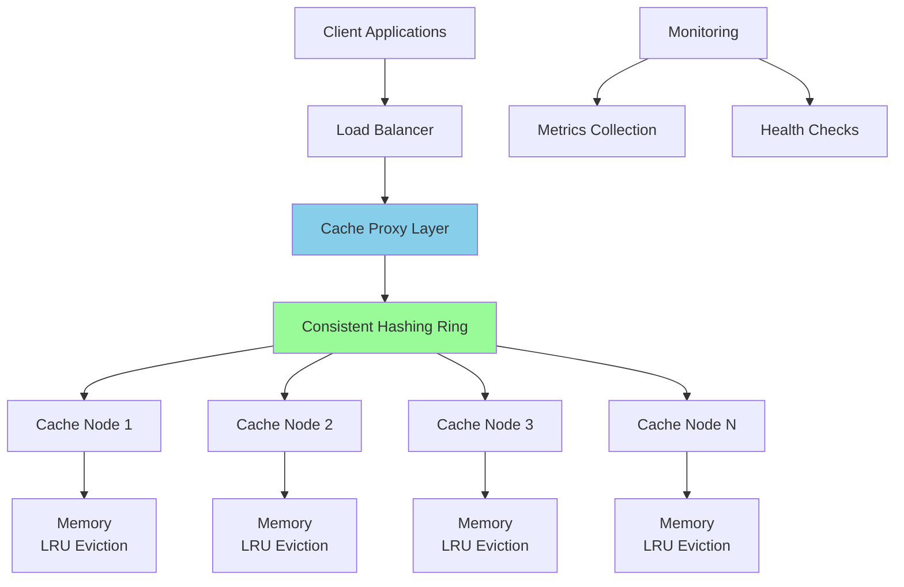

##### Detailed Design

**Consistent Hashing Implementation:**
```python
import hashlib
import bisect

class ConsistentHash:
    def __init__(self, nodes=None, replicas=3):
        self.replicas = replicas
        self.ring = {}
        self.sorted_keys = []
        
        if nodes:
            for node in nodes:
                self.add_node(node)
    
    def _hash(self, key):
        return int(hashlib.sha256(key.encode()).hexdigest(), 16)
    
    def add_node(self, node):
        for i in range(self.replicas):
            virtual_key = self._hash(f"{node}:{i}")
            self.ring[virtual_key] = node
            bisect.insort(self.sorted_keys, virtual_key)
    
    def get_node(self, key):
        if not self.ring:
            return None
        
        hash_key = self._hash(key)
        idx = bisect.bisect_right(self.sorted_keys, hash_key)
        if idx == len(self.sorted_keys):
            idx = 0
        return self.ring[self.sorted_keys[idx]]
```

**Cache Node Architecture:**
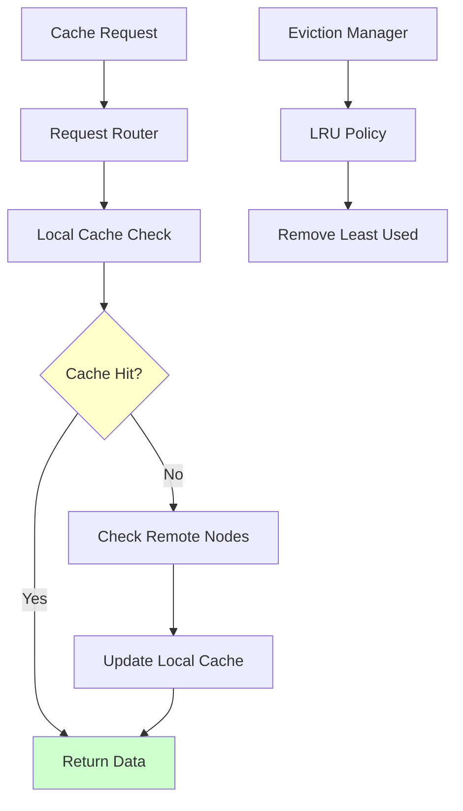

##### API Design
```http
# Cache Operations
PUT /cache/{key}
Content-Type: application/json
TTL: 3600

{
  "value": "cached_data",
  "metadata": {
    "created_at": "2024-01-15T10:30:00Z"
  }
}

GET /cache/{key}
Response: 200 OK / 404 Not Found

DELETE /cache/{key}
Response: 204 No Content

# Administrative
GET /cache/stats
GET /cache/health
POST /cache/flush
```

##### Scale Estimations
```
Assumptions:
- 100M requests/day
- Average key size: 250 bytes
- Average value size: 1KB
- Cache hit ratio: 85%

QPS: 100M / (24 * 3600) = 1,157 requests/second
Peak QPS (3x): 3,471 requests/second

Memory per node: 64GB
Total cache size needed: 100GB
Number of nodes: 2 (with replication factor 2)

Network bandwidth:
- Reads: 3,471 * 0.85 * 1KB = 2.9 MB/s
- Writes: 3,471 * 0.15 * 1KB = 0.5 MB/s
```

---

#### 2. Design a Real-time Analytics Dashboard
**Context**: Samsung needs to monitor IoT device performance across global manufacturing plants.

##### Clarifying Questions
- How many devices are we monitoring? (Millions of IoT devices)
- What metrics do we track? (Temperature, humidity, performance, errors)
- What's the data ingestion rate? (10K events/second per factory)
- Real-time requirements? (Dashboard updates every 5 seconds)
- Historical data retention? (1 year for detailed, 5 years aggregated)

##### Requirements
**Functional:**
- Ingest real-time IoT data streams
- Process and aggregate metrics
- Display real-time dashboards
- Alert on anomalies
- Support historical queries

**Non-Functional:**
- Handle 1M events/second globally
- Dashboard latency: <5 seconds
- 99.95% availability
- Horizontal scalability

##### Architecture Design

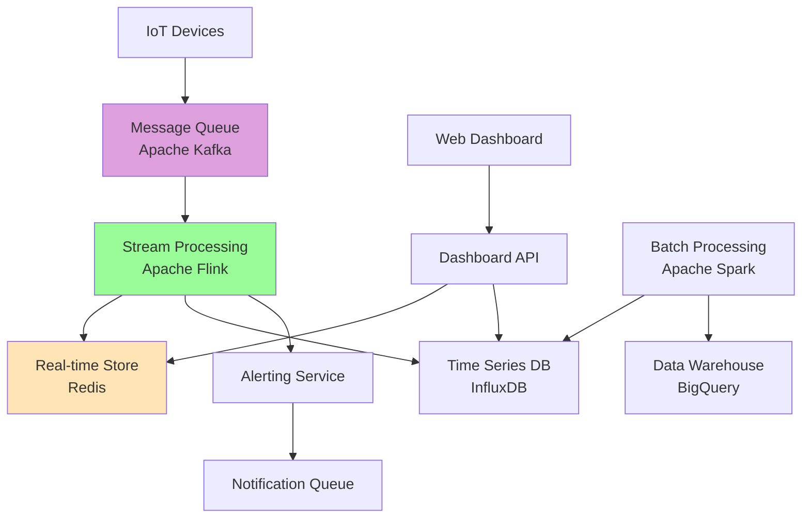

---

### Oracle Interview Questions

#### 3. Design a Notification System for Millions of Users
**Context**: Oracle Cloud needs to send notifications across multiple channels.

##### System Architecture

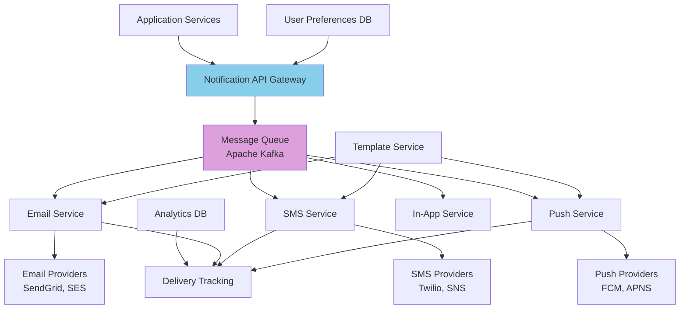

##### Notification Flow
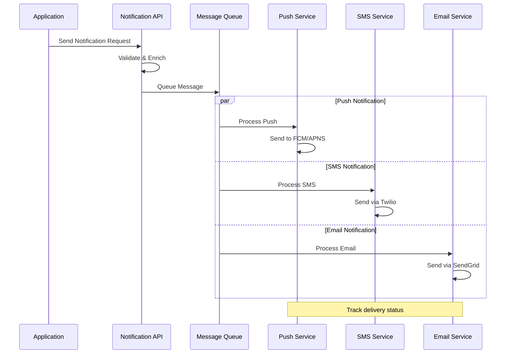

---

#### 4. Design a Global File Storage System (Dropbox-like)
**Context**: Oracle Cloud Storage competing with Dropbox/Google Drive.

##### Architecture Overview

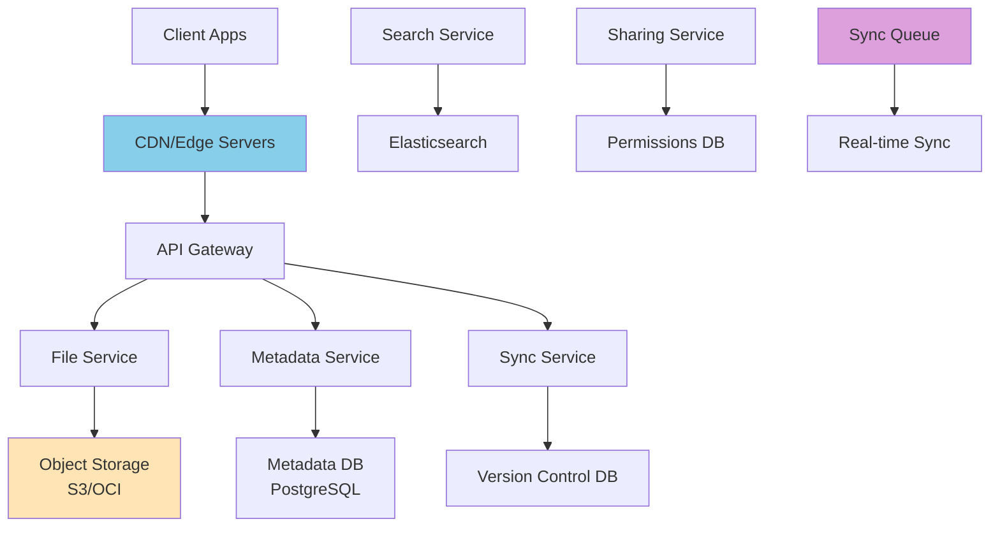

##### File Upload Flow
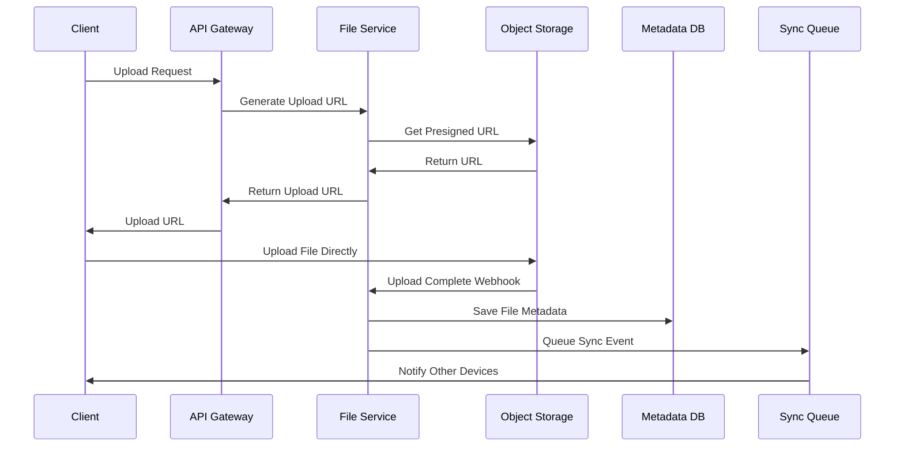

---

### Fastenal Interview Questions

#### 5. Design an Inventory Management System
**Context**: Fastenal needs to track millions of items across thousands of locations.

##### Requirements Analysis
**Functional:**
- Track inventory levels across locations
- Handle purchase orders and receipts
- Support inventory transfers
- Generate reorder alerts
- Barcode/RFID scanning support

**Non-Functional:**
- Handle 10K transactions/second
- Real-time inventory updates
- 99.9% availability
- Support for 3000+ locations

##### System Architecture

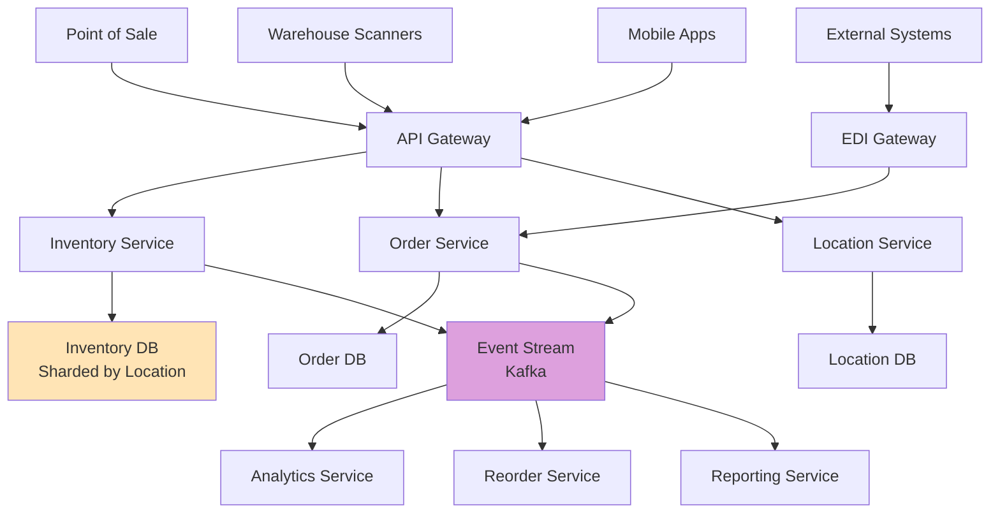

##### Database Schema

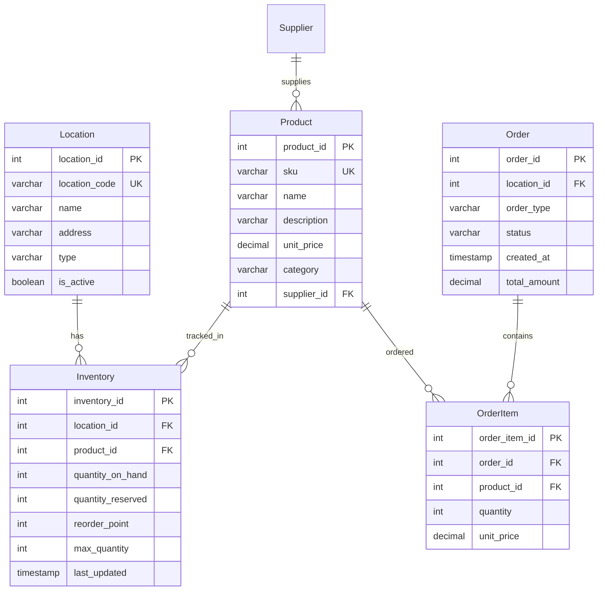

---

#### 6. Design a Supply Chain Tracking System
**Context**: Track products from suppliers through warehouses to customers.

##### End-to-End Tracking Flow

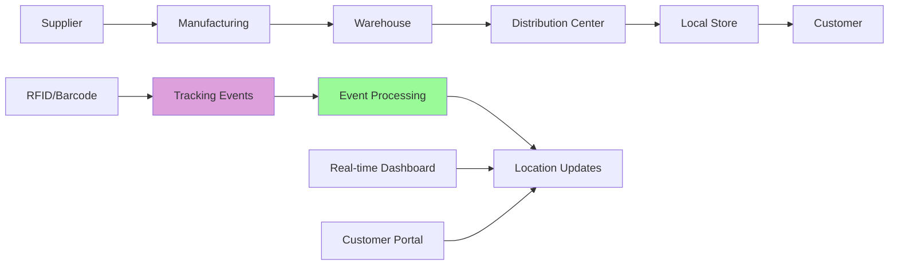

---

#### 7. Design a Warehouse Management System
**Context**: Optimize warehouse operations for Fastenal's distribution centers.

##### Warehouse Layout Optimization

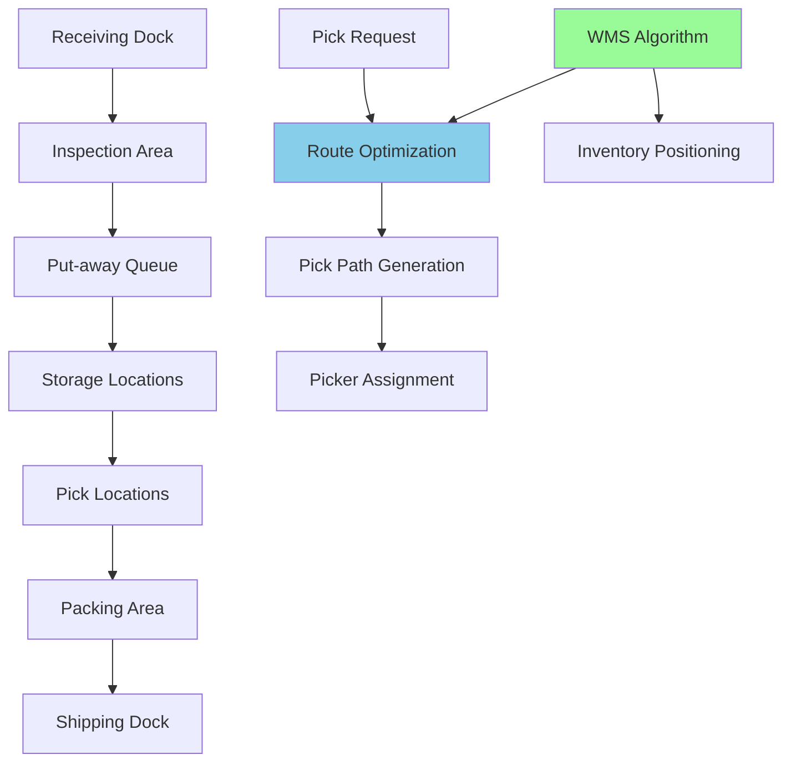

## 🎯 General Interview Tips

### 1. Clarification Questions Framework
Always start with these categories:
- **Scale**: How many users/requests/data?
- **Features**: What specific functionality is needed?
- **Performance**: Latency and throughput requirements?
- **Consistency**: Strong vs eventual consistency needs?

### 2. Design Process
1. **Requirements Gathering** (5 minutes)
2. **Capacity Estimation** (5 minutes)
3. **High-Level Design** (10 minutes)
4. **Detailed Design** (15 minutes)
5. **Scale & Bottlenecks** (10 minutes)

### 3. Common Follow-up Questions

#### For Samsung (Hardware/IoT Focus)
- "How would you handle device firmware updates?"
- "Design for offline-first mobile applications"
- "Handle real-time sensor data processing"

#### For Oracle (Enterprise/Database Focus)
- "How would you ensure ACID properties at scale?"
- "Design database migration with zero downtime"
- "Handle multi-tenant architecture challenges"

#### For Fastenal (Supply Chain/Inventory Focus)
- "How would you handle seasonal demand spikes?"
- "Design for just-in-time inventory management"
- "Handle supplier integration challenges"

### 4. Technical Deep Dives

#### Database Selection Framework
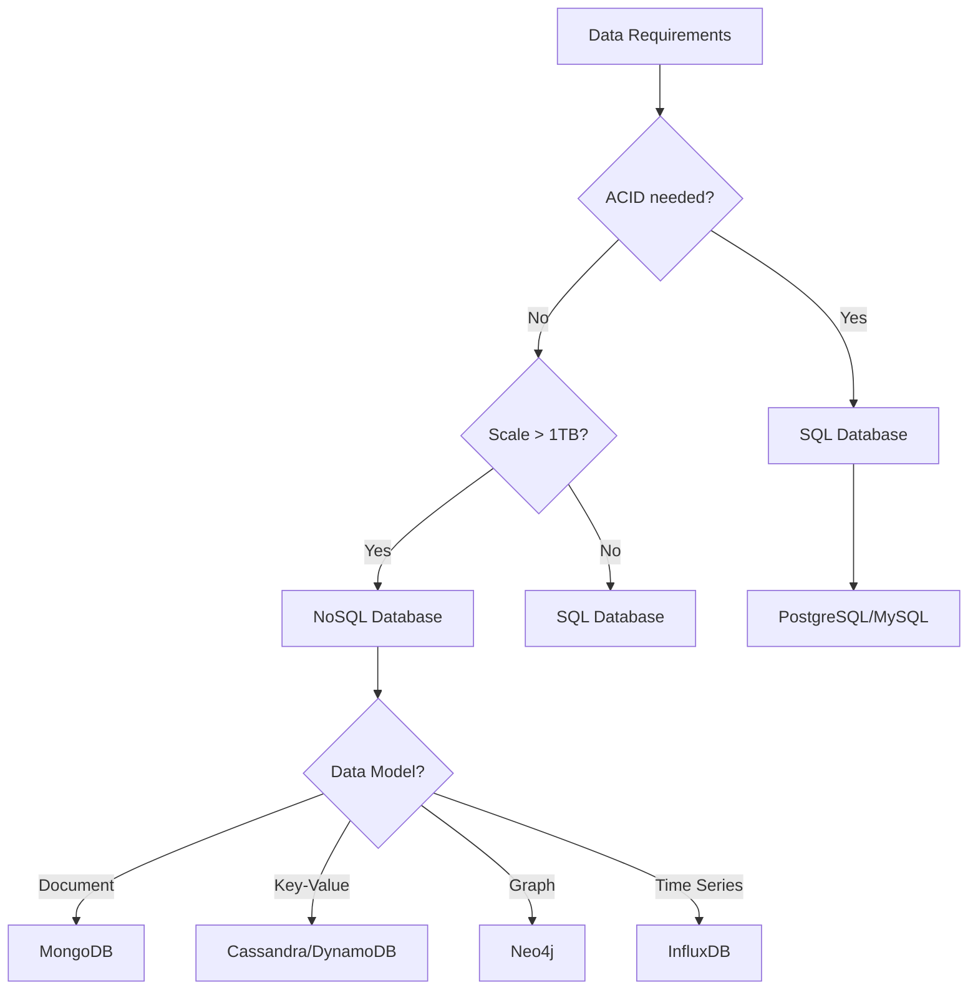

#### Caching Strategy Decision Tree
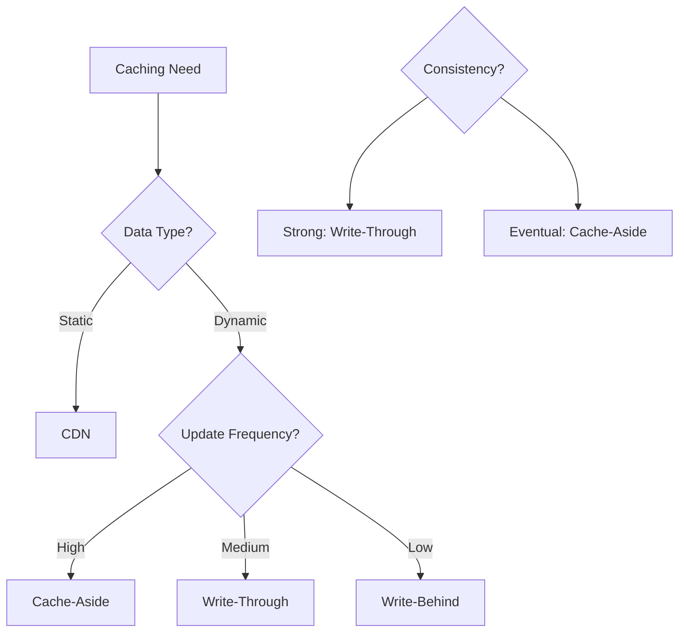

## 📊 Estimation Templates

### Storage Calculation
```
Daily Active Users: X
Average data per user per day: Y
Retention period: Z years

Total storage = X × Y × 365 × Z
With replication factor 3: Total × 3
With growth (20% yearly): Total × (1.2^Z)
```

### Bandwidth Calculation
```
Peak QPS: X requests/second
Average response size: Y KB
Peak bandwidth = X × Y KB/s

Convert to Mbps: (X × Y × 8) / 1024
```

### Server Calculation
```
Peak QPS: X
Server capacity: Y QPS
Number of servers needed: X / Y
With redundancy (N+1): (X / Y) + 1
```

---

**Success Tips**: 
1. Practice drawing diagrams quickly
2. Think out loud during the interview
3. Always consider trade-offs
4. Start simple, then add complexity
5. Ask about constraints and edge cases
