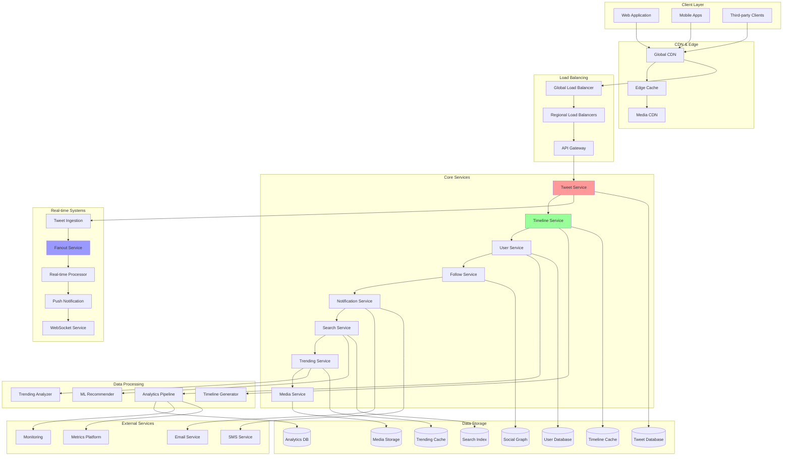
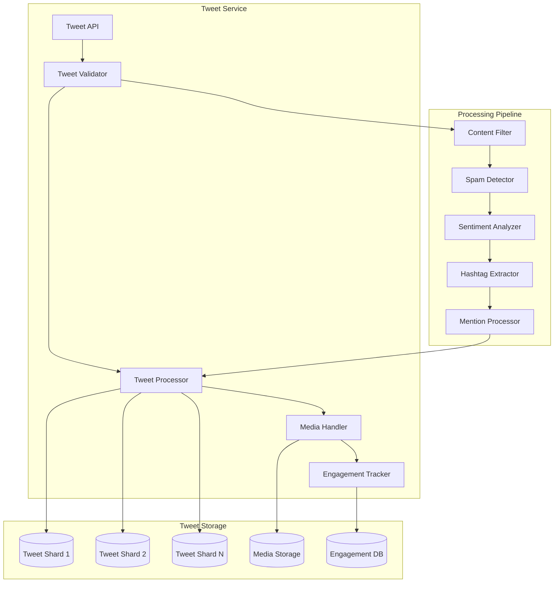
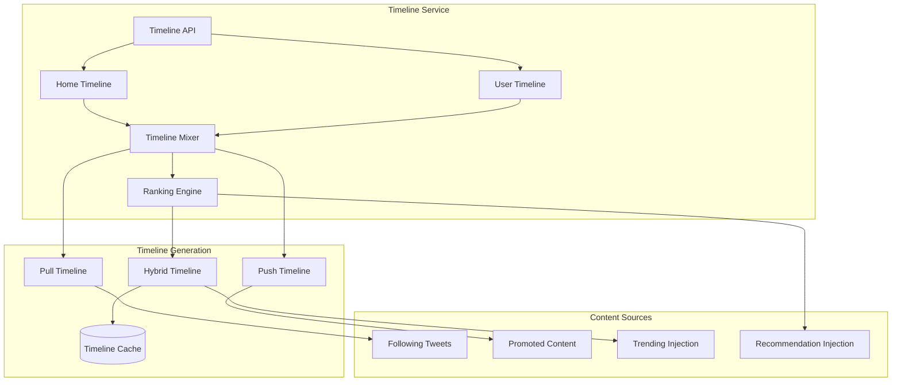
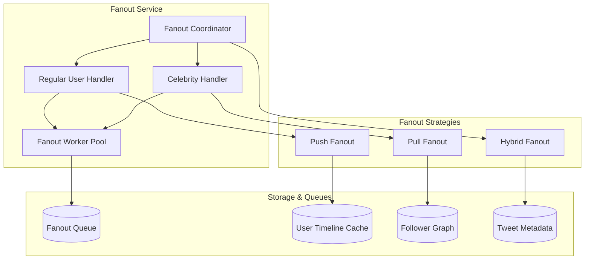

# Twitter System Design: Real-time Microblogging Platform

Twitter is a global real-time microblogging platform where users share short messages called "tweets" with their followers. This document provides a comprehensive system design for building a Twitter-like platform that handles real-time tweet distribution, trending topics, massive scale timeline generation, and global content discovery.

## 🎯 Requirements & Scale

### Functional Requirements
- **Tweet Management**: Post, edit, delete tweets (280 character limit)
- **Timeline Generation**: Home timeline, user timeline, real-time updates
- **Follow System**: Follow/unfollow users, follower/following lists
- **Real-time Features**: Live tweet streaming, real-time notifications
- **Content Discovery**: Trending topics, hashtags, search functionality
- **Engagement**: Like, retweet, reply, quote tweet functionality
- **Media Support**: Images, videos, GIFs in tweets
- **Direct Messaging**: Private messaging between users
- **Trending & Analytics**: Trending topics, tweet analytics

### Non-Functional Requirements
- **Scale**: 500M+ users, 200M+ daily active users
- **Availability**: 99.99% uptime (critical real-time platform)
- **Consistency**: Eventual consistency for timelines, strong consistency for tweets
- **Performance**: <100ms for tweet posting, <200ms for timeline loading
- **Real-time**: <1s for tweet propagation to followers

### Scale Estimations
```
Users: 500M total, 200M DAU
- Tweets: 200M DAU × 2 tweets/day = 400M tweets/day (4,630 tweets/sec)
- Timeline reads: 200M DAU × 300 timeline loads/day = 60B reads/day
- Follows: 200M DAU × 0.1 follows/day = 20M follows/day
- Likes/Retweets: 200M DAU × 10 interactions/day = 2B interactions/day

Storage:
- Tweets: 400M/day × 280 chars × 365 = 40TB/year (text only)
- Media: 400M/day × 30% × 2MB × 365 = 88PB/year
- User profiles: 500M × 2KB = 1TB
- Social graph: 500M users × 200 follows avg × 16 bytes = 1.6TB
- Total: ~90PB/year
```

## 🏗️ High-Level Architecture



## 🔧 Core Components Design

### Tweet Service Architecture


### Timeline Service Architecture


### Fanout Service Architecture


## 💾 Database Design

### Tweet Schema
```sql
-- Tweets table (sharded by tweet_id)
CREATE TABLE tweets (
    tweet_id BIGINT PRIMARY KEY,
    user_id BIGINT NOT NULL,
    content VARCHAR(280) NOT NULL,
    tweet_type ENUM('original', 'retweet', 'reply', 'quote') DEFAULT 'original',
    parent_tweet_id BIGINT NULL, -- for replies and quotes
    retweeted_tweet_id BIGINT NULL, -- for retweets
    media_urls JSON,
    hashtags JSON,
    mentions JSON,
    like_count INT DEFAULT 0,
    retweet_count INT DEFAULT 0,
    reply_count INT DEFAULT 0,
    quote_count INT DEFAULT 0,
    created_at TIMESTAMP DEFAULT CURRENT_TIMESTAMP,
    updated_at TIMESTAMP DEFAULT CURRENT_TIMESTAMP,
    is_deleted BOOLEAN DEFAULT FALSE,
    is_sensitive BOOLEAN DEFAULT FALSE,
    language VARCHAR(10),
    source VARCHAR(100), -- client app
    geo_location POINT,
    INDEX idx_user_tweets (user_id, created_at DESC),
    INDEX idx_parent_tweet (parent_tweet_id),
    INDEX idx_retweeted_tweet (retweeted_tweet_id),
    INDEX idx_created_at (created_at DESC),
    INDEX idx_hashtags ((CAST(hashtags AS CHAR(1000) ARRAY))),
    FOREIGN KEY (user_id) REFERENCES users(user_id)
);

-- Tweet engagement tracking
CREATE TABLE tweet_engagement (
    engagement_id BIGINT PRIMARY KEY AUTO_INCREMENT,
    tweet_id BIGINT NOT NULL,
    user_id BIGINT NOT NULL,
    engagement_type ENUM('like', 'retweet', 'reply', 'quote', 'view') NOT NULL,
    created_at TIMESTAMP DEFAULT CURRENT_TIMESTAMP,
    FOREIGN KEY (tweet_id) REFERENCES tweets(tweet_id),
    FOREIGN KEY (user_id) REFERENCES users(user_id),
    UNIQUE KEY unique_engagement (tweet_id, user_id, engagement_type),
    INDEX idx_tweet_engagement (tweet_id, engagement_type),
    INDEX idx_user_engagement (user_id, created_at DESC)
);

-- Tweet metrics (aggregated)
CREATE TABLE tweet_metrics (
    tweet_id BIGINT PRIMARY KEY,
    impression_count BIGINT DEFAULT 0,
    engagement_count BIGINT DEFAULT 0,
    click_count BIGINT DEFAULT 0,
    profile_click_count BIGINT DEFAULT 0,
    url_click_count BIGINT DEFAULT 0,
    hashtag_click_count BIGINT DEFAULT 0,
    engagement_rate DECIMAL(5,4) DEFAULT 0.0000,
    updated_at TIMESTAMP DEFAULT CURRENT_TIMESTAMP,
    FOREIGN KEY (tweet_id) REFERENCES tweets(tweet_id),
    INDEX idx_engagement_rate (engagement_rate DESC),
    INDEX idx_impression_count (impression_count DESC)
);
```

### User & Follow Schema
```sql
-- Users table
CREATE TABLE users (
    user_id BIGINT PRIMARY KEY,
    username VARCHAR(50) UNIQUE NOT NULL,
    display_name VARCHAR(100) NOT NULL,
    email VARCHAR(255) UNIQUE NOT NULL,
    bio VARCHAR(160),
    profile_image_url VARCHAR(500),
    banner_image_url VARCHAR(500),
    location VARCHAR(100),
    website VARCHAR(200),
    follower_count INT DEFAULT 0,
    following_count INT DEFAULT 0,
    tweet_count INT DEFAULT 0,
    like_count INT DEFAULT 0,
    created_at TIMESTAMP DEFAULT CURRENT_TIMESTAMP,
    updated_at TIMESTAMP DEFAULT CURRENT_TIMESTAMP,
    is_verified BOOLEAN DEFAULT FALSE,
    is_protected BOOLEAN DEFAULT FALSE,
    is_suspended BOOLEAN DEFAULT FALSE,
    language VARCHAR(10) DEFAULT 'en',
    timezone VARCHAR(50),
    INDEX idx_username (username),
    INDEX idx_email (email),
    INDEX idx_follower_count (follower_count DESC),
    INDEX idx_created_at (created_at)
);

-- Follow relationships (sharded by follower_id)
CREATE TABLE follows (
    follow_id BIGINT PRIMARY KEY AUTO_INCREMENT,
    follower_id BIGINT NOT NULL,
    following_id BIGINT NOT NULL,
    created_at TIMESTAMP DEFAULT CURRENT_TIMESTAMP,
    FOREIGN KEY (follower_id) REFERENCES users(user_id),
    FOREIGN KEY (following_id) REFERENCES users(user_id),
    UNIQUE KEY unique_follow (follower_id, following_id),
    INDEX idx_follower (follower_id),
    INDEX idx_following (following_id),
    INDEX idx_created_at (created_at DESC)
);

-- Timeline cache (Redis structure representation)
-- Key: timeline:{user_id}:{timeline_type}
-- Value: List of tweet_ids with metadata
CREATE TABLE timeline_cache (
    cache_key VARCHAR(200) PRIMARY KEY,
    tweet_ids JSON NOT NULL,
    last_updated TIMESTAMP DEFAULT CURRENT_TIMESTAMP,
    ttl INT DEFAULT 3600,
    INDEX idx_last_updated (last_updated)
);
```

### Trending & Search Schema
```sql
-- Hashtag tracking
CREATE TABLE hashtags (
    hashtag_id BIGINT PRIMARY KEY AUTO_INCREMENT,
    hashtag VARCHAR(100) UNIQUE NOT NULL,
    tweet_count BIGINT DEFAULT 0,
    created_at TIMESTAMP DEFAULT CURRENT_TIMESTAMP,
    INDEX idx_hashtag (hashtag),
    INDEX idx_tweet_count (tweet_count DESC)
);

-- Trending topics
CREATE TABLE trending_topics (
    trending_id BIGINT PRIMARY KEY AUTO_INCREMENT,
    hashtag_id BIGINT NOT NULL,
    region VARCHAR(10) DEFAULT 'global', -- country code or 'global'
    tweet_count_1h BIGINT DEFAULT 0,
    tweet_count_24h BIGINT DEFAULT 0,
    trend_score DECIMAL(10,4) DEFAULT 0.0000,
    rank_position INT DEFAULT 0,
    created_at TIMESTAMP DEFAULT CURRENT_TIMESTAMP,
    updated_at TIMESTAMP DEFAULT CURRENT_TIMESTAMP,
    FOREIGN KEY (hashtag_id) REFERENCES hashtags(hashtag_id),
    INDEX idx_region_rank (region, rank_position),
    INDEX idx_trend_score (trend_score DESC),
    INDEX idx_updated_at (updated_at DESC)
);

-- Search index (Elasticsearch representation)
-- This would be stored in Elasticsearch, shown here for reference
CREATE TABLE search_tweets (
    tweet_id BIGINT PRIMARY KEY,
    user_id BIGINT NOT NULL,
    username VARCHAR(50) NOT NULL,
    content TEXT NOT NULL,
    hashtags JSON,
    mentions JSON,
    created_at TIMESTAMP NOT NULL,
    engagement_score DECIMAL(10,4) DEFAULT 0.0000,
    language VARCHAR(10),
    location POINT,
    FULLTEXT INDEX idx_content (content),
    INDEX idx_hashtags ((CAST(hashtags AS CHAR(1000) ARRAY))),
    INDEX idx_engagement_score (engagement_score DESC),
    INDEX idx_created_at (created_at DESC)
);
```

## 🔄 Core Algorithms

### Timeline Generation Algorithm
```python
class TwitterTimelineGenerator:
    def __init__(self):
        self.cache = Redis()
        self.db = DatabaseManager()
        self.fanout_threshold = 1000000  # 1M followers
        
    def generate_home_timeline(self, user_id, limit=20, max_age_hours=24):
        """
        Generate personalized home timeline using hybrid approach
        """
        timeline_key = f"timeline:home:{user_id}"
        
        # Check cache first
        cached_timeline = self.cache.get(timeline_key)
        if cached_timeline and len(cached_timeline) >= limit:
            return cached_timeline[:limit]
        
        # Get user's following list
        following_list = self.get_following_list(user_id)
        
        # Separate celebrities from regular users
        celebrities, regular_users = self.classify_users_by_followers(following_list)
        
        # Generate timeline using hybrid approach
        timeline_tweets = []
        
        # 1. Get tweets from regular users (push fanout)
        regular_tweets = self.get_push_fanout_tweets(
            user_id, regular_users, limit * 2, max_age_hours
        )
        timeline_tweets.extend(regular_tweets)
        
        # 2. Get tweets from celebrities (pull fanout)
        celebrity_tweets = self.get_pull_fanout_tweets(
            celebrities, limit, max_age_hours
        )
        timeline_tweets.extend(celebrity_tweets)
        
        # 3. Merge and rank tweets
        merged_timeline = self.merge_and_rank_tweets(
            timeline_tweets, user_id, limit
        )
        
        # 4. Inject promoted content and recommendations
        final_timeline = self.inject_additional_content(
            merged_timeline, user_id, limit
        )
        
        # Cache the result
        self.cache.setex(timeline_key, 300, final_timeline)  # 5 min cache
        
        return final_timeline[:limit]
    
    def get_push_fanout_tweets(self, user_id, following_users, limit, max_age_hours):
        """
        Get tweets from users with pre-computed fanout
        """
        tweets = []
        
        # Get from pre-computed timeline cache
        for followed_user_id in following_users:
            user_tweets_key = f"user_tweets:{followed_user_id}"
            user_tweets = self.cache.lrange(user_tweets_key, 0, 50)
            
            for tweet_data in user_tweets:
                tweet = json.loads(tweet_data)
                tweet_age = (datetime.now() - tweet['created_at']).hours
                
                if tweet_age <= max_age_hours:
                    tweets.append(tweet)
        
        return tweets
    
    def get_pull_fanout_tweets(self, celebrity_users, limit, max_age_hours):
        """
        Get recent tweets from celebrities (real-time pull)
        """
        cutoff_time = datetime.now() - timedelta(hours=max_age_hours)
        
        query = """
        SELECT t.*, u.username, u.display_name, u.profile_image_url
        FROM tweets t
        JOIN users u ON t.user_id = u.user_id
        WHERE t.user_id IN %s
        AND t.created_at >= %s
        AND t.is_deleted = FALSE
        ORDER BY t.created_at DESC
        LIMIT %s
        """
        
        return self.db.execute(query, (celebrity_users, cutoff_time, limit * 2))
    
    def merge_and_rank_tweets(self, tweets, user_id, limit):
        """
        Merge tweets from different sources and apply ranking
        """
        # Remove duplicates
        unique_tweets = self.deduplicate_tweets(tweets)
        
        # Apply ML ranking model
        ranked_tweets = self.apply_ranking_model(unique_tweets, user_id)
        
        return ranked_tweets[:limit]
    
    def apply_ranking_model(self, tweets, user_id):
        """
        Apply machine learning ranking model to sort tweets
        """
        user_profile = self.get_user_engagement_profile(user_id)
        ranked_tweets = []
        
        for tweet in tweets:
            # Extract features for ranking
            features = self.extract_tweet_features(tweet, user_id, user_profile)
            
            # Predict engagement probability
            engagement_score = self.ml_model.predict_engagement(features)
            
            # Apply business rules
            final_score = self.apply_ranking_adjustments(
                engagement_score, tweet, user_id
            )
            
            ranked_tweets.append({
                'tweet': tweet,
                'score': final_score
            })
        
        # Sort by score
        ranked_tweets.sort(key=lambda x: x['score'], reverse=True)
        
        return [item['tweet'] for item in ranked_tweets]
    
    def extract_tweet_features(self, tweet, user_id, user_profile):
        """
        Extract features for ML ranking model
        """
        features = {
            # Content features
            'tweet_length': len(tweet['content']),
            'has_media': bool(tweet.get('media_urls')),
            'has_hashtags': bool(tweet.get('hashtags')),
            'has_mentions': bool(tweet.get('mentions')),
            'has_urls': self.has_urls(tweet['content']),
            
            # Author features
            'author_follower_count': tweet['author_follower_count'],
            'author_verification': tweet['author_is_verified'],
            'author_relationship': self.get_relationship_strength(user_id, tweet['user_id']),
            
            # Engagement features
            'like_count': tweet['like_count'],
            'retweet_count': tweet['retweet_count'],
            'reply_count': tweet['reply_count'],
            'engagement_velocity': self.calculate_engagement_velocity(tweet),
            
            # Temporal features
            'tweet_age_minutes': (datetime.now() - tweet['created_at']).seconds / 60,
            'posting_hour': tweet['created_at'].hour,
            'is_weekend': tweet['created_at'].weekday() >= 5,
            
            # User affinity features
            'topic_affinity': self.calculate_topic_affinity(tweet, user_profile),
            'author_interaction_history': self.get_interaction_history(user_id, tweet['user_id']),
            'similar_tweet_engagement': self.get_similar_tweet_engagement(tweet, user_id),
        }
        
        return features
```

### Real-time Fanout Algorithm
```python
class TwitterFanoutService:
    def __init__(self):
        self.cache = Redis()
        self.queue = MessageQueue()
        self.celebrity_threshold = 1000000  # 1M followers
        
    def fanout_tweet(self, tweet_id, author_id):
        """
        Fanout tweet to followers using appropriate strategy
        """
        author_stats = self.get_author_stats(author_id)
        follower_count = author_stats['follower_count']
        
        if follower_count >= self.celebrity_threshold:
            # Celebrity user - use pull model
            self.handle_celebrity_fanout(tweet_id, author_id)
        else:
            # Regular user - use push model
            self.handle_regular_fanout(tweet_id, author_id)
    
    def handle_regular_fanout(self, tweet_id, author_id):
        """
        Push fanout for regular users with manageable follower counts
        """
        # Get all followers
        followers = self.get_all_followers(author_id)
        
        # Batch followers for parallel processing
        batch_size = 1000
        follower_batches = [
            followers[i:i + batch_size] 
            for i in range(0, len(followers), batch_size)
        ]
        
        # Process batches in parallel
        for batch in follower_batches:
            self.queue.publish('fanout_batch', {
                'tweet_id': tweet_id,
                'author_id': author_id,
                'followers': batch,
                'fanout_type': 'push'
            })
    
    def handle_celebrity_fanout(self, tweet_id, author_id):
        """
        Pull fanout for celebrities - just update their tweet list
        """
        # Add tweet to celebrity's tweet list
        celebrity_tweets_key = f"celebrity_tweets:{author_id}"
        tweet_data = self.get_tweet_data(tweet_id)
        
        # Store in sorted set with timestamp score for ordering
        self.cache.zadd(
            celebrity_tweets_key,
            {json.dumps(tweet_data): tweet_data['created_at_timestamp']}
        )
        
        # Keep only recent tweets (last 24 hours)
        cutoff_timestamp = time.time() - (24 * 3600)
        self.cache.zremrangebyscore(celebrity_tweets_key, 0, cutoff_timestamp)
        
        # Notify real-time systems
        self.notify_real_time_systems(tweet_id, author_id, 'celebrity')
    
    def process_fanout_batch(self, batch_data):
        """
        Process a batch of followers for fanout
        """
        tweet_id = batch_data['tweet_id']
        author_id = batch_data['author_id']
        followers = batch_data['followers']
        
        tweet_data = self.get_tweet_data(tweet_id)
        
        # Pipeline Redis operations for efficiency
        pipe = self.cache.pipeline()
        
        for follower_id in followers:
            timeline_key = f"timeline:home:{follower_id}"
            
            # Add tweet to follower's timeline
            pipe.lpush(timeline_key, json.dumps(tweet_data))
            
            # Trim timeline to keep only recent tweets
            pipe.ltrim(timeline_key, 0, 800)  # Keep 800 recent tweets
            
            # Set expiration
            pipe.expire(timeline_key, 86400)  # 24 hours
        
        # Execute all operations
        pipe.execute()
        
        # Send real-time notifications to active users
        self.send_real_time_notifications(followers, tweet_data)
    
    def send_real_time_notifications(self, followers, tweet_data):
        """
        Send real-time notifications to active followers
        """
        # Get currently active followers (WebSocket connections)
        active_followers = self.get_active_followers(followers)
        
        for follower_id in active_followers:
            # Send WebSocket notification
            self.websocket_service.send_notification(follower_id, {
                'type': 'new_tweet',
                'tweet': tweet_data,
                'timestamp': time.time()
            })
```

### Trending Topics Algorithm
```python
class TwitterTrendingService:
    def __init__(self):
        self.cache = Redis()
        self.db = DatabaseManager()
        self.time_windows = [3600, 86400]  # 1 hour, 24 hours
        
    def calculate_trending_topics(self, region='global', limit=20):
        """
        Calculate trending topics using volume and velocity analysis
        """
        current_time = time.time()
        trending_topics = []
        
        # Get hashtag volumes for different time windows
        for hashtag_data in self.get_hashtag_activity(region):
            hashtag = hashtag_data['hashtag']
            
            # Calculate metrics for each time window
            volumes = {}
            velocities = {}
            
            for window in self.time_windows:
                window_start = current_time - window
                
                # Get tweet count in this window
                volumes[window] = self.get_hashtag_volume(
                    hashtag, window_start, current_time, region
                )
                
                # Calculate velocity (change rate)
                prev_window_start = window_start - window
                prev_volume = self.get_hashtag_volume(
                    hashtag, prev_window_start, window_start, region
                )
                
                if prev_volume > 0:
                    velocities[window] = (volumes[window] - prev_volume) / prev_volume
                else:
                    velocities[window] = float('inf') if volumes[window] > 0 else 0
            
            # Calculate trend score
            trend_score = self.calculate_trend_score(volumes, velocities)
            
            # Apply quality filters
            if self.passes_trending_filters(hashtag, volumes, trend_score):
                trending_topics.append({
                    'hashtag': hashtag,
                    'trend_score': trend_score,
                    'volume_1h': volumes[3600],
                    'volume_24h': volumes[86400],
                    'velocity_1h': velocities[3600],
                    'velocity_24h': velocities[86400]
                })
        
        # Sort by trend score and return top N
        trending_topics.sort(key=lambda x: x['trend_score'], reverse=True)
        
        return trending_topics[:limit]
    
    def calculate_trend_score(self, volumes, velocities):
        """
        Calculate trend score using volume and velocity
        """
        # Weighted combination of volume and velocity
        volume_weight = 0.3
        velocity_weight = 0.7
        
        # Normalize volumes (log scale to handle wide range)
        normalized_volume_1h = math.log10(max(volumes[3600], 1))
        normalized_volume_24h = math.log10(max(volumes[86400], 1))
        
        # Cap velocities to handle extreme values
        capped_velocity_1h = min(velocities[3600], 10.0)
        capped_velocity_24h = min(velocities[86400], 5.0)
        
        # Calculate composite score
        volume_score = (normalized_volume_1h * 0.7) + (normalized_volume_24h * 0.3)
        velocity_score = (capped_velocity_1h * 0.8) + (capped_velocity_24h * 0.2)
        
        trend_score = (volume_score * volume_weight) + (velocity_score * velocity_weight)
        
        return trend_score
    
    def passes_trending_filters(self, hashtag, volumes, trend_score):
        """
        Apply quality filters to trending topics
        """
        # Minimum volume threshold
        if volumes[3600] < 100:  # At least 100 tweets in last hour
            return False
        
        # Minimum trend score
        if trend_score < 1.0:
            return False
        
        # Content policy filters
        if self.is_blocked_hashtag(hashtag):
            return False
        
        # Spam/bot detection
        if self.is_likely_bot_hashtag(hashtag, volumes):
            return False
        
        return True
    
    def update_trending_cache(self, region='global'):
        """
        Update trending topics cache for real-time access
        """
        trending_topics = self.calculate_trending_topics(region)
        
        cache_key = f"trending:{region}"
        self.cache.setex(
            cache_key, 
            300,  # 5 minutes cache
            json.dumps(trending_topics)
        )
        
        # Update database for persistence
        self.store_trending_topics(trending_topics, region)
```

## ⚡ Performance Optimizations

### Caching Strategy
```python
class TwitterCacheManager:
    def __init__(self):
        self.l1_cache = {}  # Application memory
        self.l2_cache = Redis()  # Redis cluster
        self.l3_cache = Memcached()  # Memcached cluster
        
        self.cache_config = {
            'tweets': {'ttl': 3600, 'layer': 'l2'},
            'timelines': {'ttl': 300, 'layer': 'l2'},
            'user_profiles': {'ttl': 1800, 'layer': 'l2'},
            'trending': {'ttl': 300, 'layer': 'l2'},
            'search_results': {'ttl': 600, 'layer': 'l3'},
            'media_metadata': {'ttl': 7200, 'layer': 'l3'},
        }
    
    def get_multi_layer_cache(self, key, cache_type):
        """
        Multi-layer caching with fallback
        """
        config = self.cache_config.get(cache_type, {'ttl': 600, 'layer': 'l2'})
        
        # L1 Cache (application memory)
        if key in self.l1_cache:
            return self.l1_cache[key]
        
        # L2 Cache (Redis)
        if config['layer'] in ['l2', 'l3']:
            value = self.l2_cache.get(key)
            if value:
                # Promote to L1 for hot data
                self.l1_cache[key] = json.loads(value)
                return self.l1_cache[key]
        
        # L3 Cache (Memcached)
        if config['layer'] == 'l3':
            value = self.l3_cache.get(key)
            if value:
                # Promote to L2 and L1
                self.l2_cache.setex(key, config['ttl'], value)
                self.l1_cache[key] = json.loads(value)
                return self.l1_cache[key]
        
        return None
    
    def set_multi_layer_cache(self, key, value, cache_type):
        """
        Set value in appropriate cache layers
        """
        config = self.cache_config.get(cache_type, {'ttl': 600, 'layer': 'l2'})
        value_json = json.dumps(value, default=str)
        
        # Always cache in L1 for immediate access
        self.l1_cache[key] = value
        
        # Cache in Redis
        if config['layer'] in ['l2', 'l3']:
            self.l2_cache.setex(key, config['ttl'], value_json)
        
        # Cache in Memcached for less critical data
        if config['layer'] == 'l3':
            self.l3_cache.set(key, value_json, time=config['ttl'])
```

### Database Sharding Strategy
```python
class TwitterShardingManager:
    def __init__(self):
        self.tweet_shards = 64
        self.user_shards = 16
        self.timeline_shards = 32
        
    def get_tweet_shard(self, tweet_id):
        """
        Determine tweet shard based on tweet ID
        """
        # Use tweet ID for even distribution
        shard_id = tweet_id % self.tweet_shards
        return f"tweets_shard_{shard_id}"
    
    def get_user_shard(self, user_id):
        """
        Determine user shard based on user ID
        """
        shard_id = user_id % self.user_shards
        return f"users_shard_{shard_id}"
    
    def get_timeline_shard(self, user_id):
        """
        Determine timeline shard (co-located with user data)
        """
        shard_id = user_id % self.timeline_shards
        return f"timelines_shard_{shard_id}"
    
    def execute_cross_shard_query(self, query, shard_type, shard_keys):
        """
        Execute query across multiple shards in parallel
        """
        with ThreadPoolExecutor(max_workers=len(shard_keys)) as executor:
            futures = []
            
            for shard_key in shard_keys:
                shard_connection = self.get_shard_connection(shard_type, shard_key)
                future = executor.submit(shard_connection.execute, query)
                futures.append(future)
            
            # Collect results
            results = []
            for future in futures:
                try:
                    result = future.result(timeout=5.0)
                    results.extend(result)
                except Exception as e:
                    logging.error(f"Shard query failed: {e}")
            
            return results
```

## 🔒 Security & Content Moderation

### Content Moderation Pipeline
```python
class TwitterContentModerator:
    def __init__(self):
        self.ml_classifier = MLContentClassifier()
        self.spam_detector = SpamDetector()
        self.toxicity_analyzer = ToxicityAnalyzer()
        
    def moderate_tweet(self, tweet_content, user_id, media_urls=None):
        """
        Comprehensive content moderation pipeline
        """
        moderation_result = {
            'approved': True,
            'flags': [],
            'confidence_scores': {},
            'actions': []
        }
        
        # 1. Spam detection
        spam_score = self.spam_detector.analyze(tweet_content, user_id)
        moderation_result['confidence_scores']['spam'] = spam_score
        
        if spam_score > 0.8:
            moderation_result['approved'] = False
            moderation_result['flags'].append('spam')
            moderation_result['actions'].append('block')
        
        # 2. Toxicity analysis
        toxicity_score = self.toxicity_analyzer.analyze(tweet_content)
        moderation_result['confidence_scores']['toxicity'] = toxicity_score
        
        if toxicity_score > 0.7:
            moderation_result['approved'] = False
            moderation_result['flags'].append('toxic_content')
            moderation_result['actions'].append('review')
        
        # 3. Hate speech detection
        hate_speech_score = self.ml_classifier.classify_hate_speech(tweet_content)
        moderation_result['confidence_scores']['hate_speech'] = hate_speech_score
        
        if hate_speech_score > 0.6:
            moderation_result['approved'] = False
            moderation_result['flags'].append('hate_speech')
            moderation_result['actions'].append('block')
        
        # 4. Misinformation detection
        if self.contains_disputed_information(tweet_content):
            moderation_result['flags'].append('disputed_information')
            moderation_result['actions'].append('add_warning_label')
        
        # 5. Media content analysis
        if media_urls:
            media_moderation = self.moderate_media(media_urls)
            if not media_moderation['approved']:
                moderation_result['approved'] = False
                moderation_result['flags'].extend(media_moderation['flags'])
                moderation_result['actions'].extend(media_moderation['actions'])
        
        return moderation_result
    
    def moderate_media(self, media_urls):
        """
        Analyze media content for policy violations
        """
        moderation_result = {
            'approved': True,
            'flags': [],
            'actions': []
        }
        
        for media_url in media_urls:
            # Image/video analysis using ML models
            media_analysis = self.analyze_media_content(media_url)
            
            if media_analysis['contains_nudity'] > 0.8:
                moderation_result['approved'] = False
                moderation_result['flags'].append('adult_content')
                moderation_result['actions'].append('mark_sensitive')
            
            if media_analysis['contains_violence'] > 0.7:
                moderation_result['approved'] = False
                moderation_result['flags'].append('graphic_violence')
                moderation_result['actions'].append('block')
        
        return moderation_result
```

## 📊 Analytics & Monitoring

### Real-time Analytics
```python
class TwitterAnalytics:
    def __init__(self):
        self.metrics_client = MetricsClient()
        self.real_time_aggregator = RealTimeAggregator()
        
    def track_tweet_metrics(self, tweet_id, user_id, engagement_type):
        """
        Track tweet engagement in real-time
        """
        # Real-time counters
        self.metrics_client.increment(f'tweet.{engagement_type}', {
            'tweet_id': tweet_id,
            'user_id': user_id
        })
        
        # Update aggregated metrics
        self.real_time_aggregator.update_metric(
            f'tweet_engagement:{tweet_id}',
            engagement_type,
            1
        )
        
        # Update user metrics
        self.real_time_aggregator.update_metric(
            f'user_engagement:{user_id}',
            f'total_{engagement_type}s',
            1
        )
    
    def generate_trending_analytics(self):
        """
        Generate real-time trending analytics
        """
        analytics = {
            'top_hashtags': self.get_top_hashtags(hours=1, limit=20),
            'viral_tweets': self.get_viral_tweets(hours=6, min_engagement=1000),
            'engagement_velocity': self.calculate_platform_engagement_velocity(),
            'user_activity': self.get_user_activity_metrics(),
            'platform_health': self.calculate_platform_health_score()
        }
        
        return analytics
    
    def calculate_platform_health_score(self):
        """
        Calculate overall platform health score
        """
        metrics = {
            'api_latency': self.get_avg_api_latency(),
            'error_rate': self.get_error_rate(),
            'tweet_delivery_success': self.get_tweet_delivery_success_rate(),
            'user_satisfaction': self.get_user_satisfaction_score()
        }
        
        # Weighted health score
        health_score = (
            (100 - min(metrics['api_latency'], 100)) * 0.3 +
            (100 - metrics['error_rate']) * 0.3 +
            metrics['tweet_delivery_success'] * 0.2 +
            metrics['user_satisfaction'] * 0.2
        )
        
        return health_score
```

## 🚀 Deployment & Scaling

### Auto-scaling Configuration
```yaml
apiVersion: autoscaling/v2
kind: HorizontalPodAutoscaler
metadata:
  name: twitter-services-hpa
spec:
  scaleTargetRef:
    apiVersion: apps/v1
    kind: Deployment
    name: twitter-timeline-service
  minReplicas: 20
  maxReplicas: 500
  metrics:
  - type: Resource
    resource:
      name: cpu
      target:
        type: Utilization
        averageUtilization: 60
  - type: Resource
    resource:
      name: memory
      target:
        type: Utilization
        averageUtilization: 70
  - type: Pods
    pods:
      metric:
        name: requests_per_second
      target:
        type: AverageValue
        averageValue: "2000"
  - type: Pods
    pods:
      metric:
        name: timeline_generation_latency
      target:
        type: AverageValue
        averageValue: "100m"  # 100ms
  behavior:
    scaleUp:
      stabilizationWindowSeconds: 30
      policies:
      - type: Percent
        value: 100
        periodSeconds: 30
    scaleDown:
      stabilizationWindowSeconds: 300
      policies:
      - type: Percent
        value: 20
        periodSeconds: 60
```

## 📈 Trade-offs & Design Decisions

### Timeline Generation Trade-offs

| Strategy | Pros | Cons | Best For |
|----------|------|------|----------|
| **Push (Fanout on Write)** | Fast reads, pre-computed | High write amplification, storage cost | Regular users (<1M followers) |
| **Pull (Fanout on Read)** | Storage efficient, real-time | Slow reads, compute intensive | Celebrities (>1M followers) |
| **Hybrid Approach** | Balanced performance | Complex implementation | Mixed user base |

### Consistency Trade-offs

| Component | Consistency Level | Rationale |
|-----------|------------------|-----------|
| **Tweet Creation** | Strong | Data integrity critical |
| **Timeline Delivery** | Eventual | Performance over consistency |
| **Follower Counts** | Eventual | Approximation acceptable |
| **Direct Messages** | Strong | Privacy and ordering critical |

### Caching Strategy Trade-offs

| Cache Type | TTL | Trade-off |
|------------|-----|-----------|
| **User Timelines** | 5 minutes | Fresh content vs performance |
| **Tweet Content** | 1 hour | Immutable content, safe to cache |
| **Trending Topics** | 5 minutes | Real-time trends vs compute cost |
| **User Profiles** | 30 minutes | Profile changes vs read performance |

## 🎯 Success Metrics

### Performance Metrics
- **Tweet Post Latency**: <100ms for 95% of requests
- **Timeline Load Time**: <200ms for home timeline
- **Search Response Time**: <300ms for text search
- **Real-time Delivery**: <1s for tweet propagation

### Scale Metrics
- **Daily Active Users**: 200M+ target
- **Tweets per Second**: 4,630 average, 20,000+ peak
- **Timeline Requests**: 60B+ daily
- **Search Queries**: 2B+ daily

### Reliability Metrics
- **System Uptime**: 99.99% availability
- **Data Durability**: 99.999999999% (11 9's)
- **Tweet Delivery Success**: 99.9%
- **Real-time Message Delivery**: 99.5%

This Twitter system design demonstrates how to build a real-time microblogging platform that can handle massive scale while maintaining sub-second response times and near-perfect availability. The architecture emphasizes real-time content distribution, intelligent caching, and efficient timeline generation algorithms.
