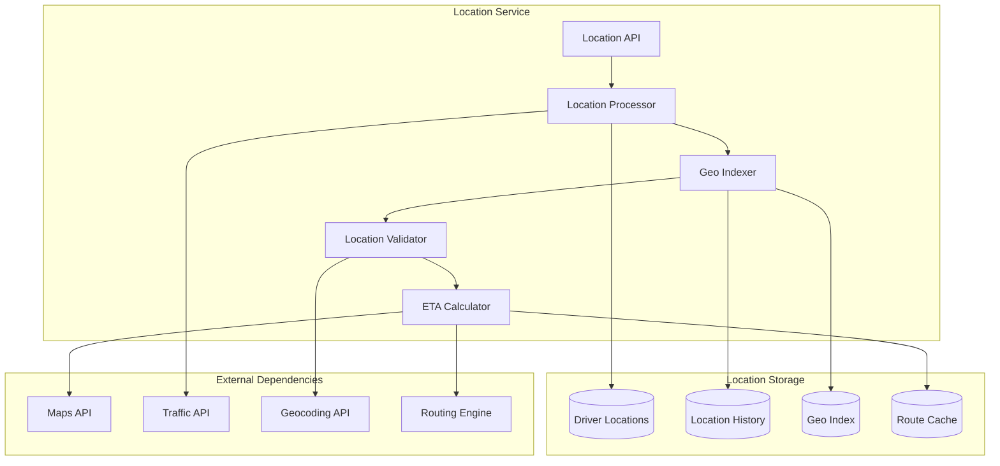
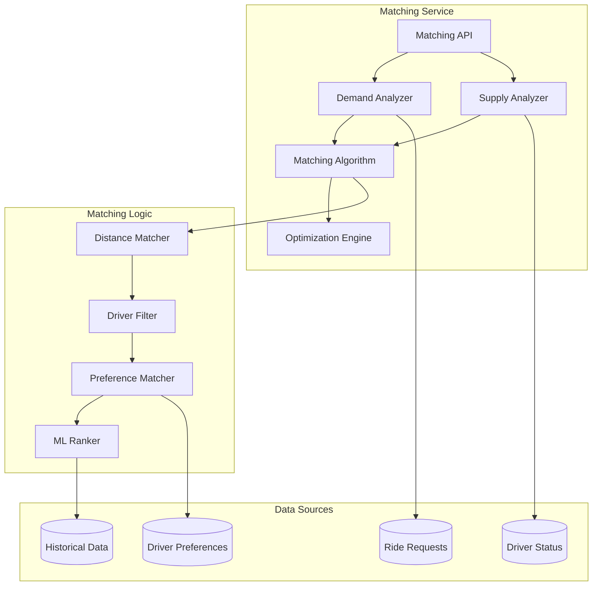
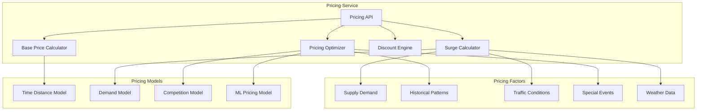

# Uber System Design: Global Ride-Hailing Platform

Uber is the world's largest ride-hailing platform connecting millions of riders with drivers across 900+ cities globally. This document provides a comprehensive system design for building an Uber-like platform that handles real-time location tracking, intelligent matching algorithms, dynamic pricing, payment processing, and global scalability.

## 🎯 Requirements & Scale

### Functional Requirements
- **User Management**: Rider and driver profiles, authentication, verification
- **Real-time Location**: GPS tracking, location updates, route optimization
- **Ride Matching**: Intelligent driver-rider matching with ETA calculations
- **Trip Management**: Trip booking, tracking, completion, cancellation
- **Dynamic Pricing**: Surge pricing based on supply-demand
- **Payment Processing**: Multiple payment methods, split bills, receipts
- **Navigation**: Turn-by-turn directions, traffic-aware routing
- **Ratings & Reviews**: Bi-directional rating system
- **Trip History**: Complete trip records and analytics
- **Driver Economics**: Earnings tracking, incentives, analytics

### Non-Functional Requirements
- **Scale**: 100M+ active users, 15M+ trips daily
- **Availability**: 99.99% uptime (critical transportation service)
- **Consistency**: Strong consistency for payments, eventual for location
- **Performance**: <3s for ride matching, <1s for location updates
- **Global**: Multi-region deployment with local compliance

### Scale Estimations
```
Users: 100M active (80M riders, 20M drivers)
- Daily trips: 15M trips/day (173 trips/second)
- Location updates: 20M drivers × 4 updates/min = 1.3M updates/sec
- Concurrent rides: ~500K rides at peak
- Payment transactions: 15M/day = 173 TPS

Storage:
- User profiles: 100M × 2KB = 200GB
- Trip records: 15M/day × 1KB × 365 = 5.5TB/year
- Location data: 1.3M/sec × 100 bytes × 86400 = 11TB/day
- Maps & routing: 100TB (global map data)
- Total: ~40TB/year + 4PB location data
```

## 🏗️ High-Level Architecture



```mermaid
graph TB
    subgraph "Client Applications"
        RIDER_APP[Rider Mobile App]
        DRIVER_APP[Driver Mobile App]
        WEB_APP[Web Application]
        ADMIN_PANEL[Admin Panel]
    end
    
    subgraph "API Gateway & Load Balancing"
        API_GATEWAY[API Gateway]
        LOAD_BALANCER[Load Balancer]
        RATE_LIMITER[Rate Limiter]
        AUTH_SERVICE[Auth Service]
    end
    
    subgraph "Core Business Services"
        USER_SERVICE[User Service]
        LOCATION_SERVICE[Location Service]
        MATCHING_SERVICE[Matching Service]
        TRIP_SERVICE[Trip Service]
        PRICING_SERVICE[Pricing Service]
        PAYMENT_SERVICE[Payment Service]
        NOTIFICATION_SERVICE[Notification Service]
        RATING_SERVICE[Rating Service]
    end
    
    subgraph "Real-time Services"
        LOCATION_TRACKER[Location Tracker]
        WEBSOCKET_SERVICE[WebSocket Service]
        PUSH_NOTIFICATIONS[Push Notifications]
        REAL_TIME_MATCHING[Real-time Matching]
        TRIP_TRACKER[Trip Tracker]
    end
    
    subgraph "External Services"
        MAPS_SERVICE[Maps & Routing]
        PAYMENT_GATEWAY[Payment Gateway]
        SMS_SERVICE[SMS Service]
        EMAIL_SERVICE[Email Service]
        FRAUD_DETECTION[Fraud Detection]
        BACKGROUND_CHECK[Background Check]
    end
    
    subgraph "Data Processing"
        SUPPLY_DEMAND_ANALYZER[Supply Demand Analyzer]
        SURGE_PRICING_ENGINE[Surge Pricing Engine]
        ROUTE_OPTIMIZER[Route Optimizer]
        ANALYTICS_PIPELINE[Analytics Pipeline]
        ML_MODELS[ML Models]
    end
    
    subgraph "Data Storage"
        USER_DB[(User Database)]
        TRIP_DB[(Trip Database)]
        LOCATION_DB[(Location Database)]
        PRICING_DB[(Pricing Database)]
        PAYMENT_DB[(Payment Database)]
        ANALYTICS_DB[(Analytics Database)]
        CACHE_LAYER[Cache Layer]
        FILE_STORAGE[File Storage]
    end
    
    RIDER_APP --> API_GATEWAY
    DRIVER_APP --> API_GATEWAY
    WEB_APP --> API_GATEWAY
    ADMIN_PANEL --> API_GATEWAY
    
    API_GATEWAY --> LOAD_BALANCER
    LOAD_BALANCER --> RATE_LIMITER
    RATE_LIMITER --> AUTH_SERVICE
    
    AUTH_SERVICE --> USER_SERVICE
    USER_SERVICE --> LOCATION_SERVICE
    LOCATION_SERVICE --> MATCHING_SERVICE
    MATCHING_SERVICE --> TRIP_SERVICE
    TRIP_SERVICE --> PRICING_SERVICE
    PRICING_SERVICE --> PAYMENT_SERVICE
    PAYMENT_SERVICE --> NOTIFICATION_SERVICE
    NOTIFICATION_SERVICE --> RATING_SERVICE
    
    LOCATION_SERVICE --> LOCATION_TRACKER
    MATCHING_SERVICE --> WEBSOCKET_SERVICE
    NOTIFICATION_SERVICE --> PUSH_NOTIFICATIONS
    MATCHING_SERVICE --> REAL_TIME_MATCHING
    TRIP_SERVICE --> TRIP_TRACKER
    
    LOCATION_SERVICE --> MAPS_SERVICE
    PAYMENT_SERVICE --> PAYMENT_GATEWAY
    NOTIFICATION_SERVICE --> SMS_SERVICE
    NOTIFICATION_SERVICE --> EMAIL_SERVICE
    USER_SERVICE --> FRAUD_DETECTION
    USER_SERVICE --> BACKGROUND_CHECK
    
    PRICING_SERVICE --> SUPPLY_DEMAND_ANALYZER
    PRICING_SERVICE --> SURGE_PRICING_ENGINE
    LOCATION_SERVICE --> ROUTE_OPTIMIZER
    USER_SERVICE --> ANALYTICS_PIPELINE
    MATCHING_SERVICE --> ML_MODELS
    
    USER_SERVICE --> USER_DB
    TRIP_SERVICE --> TRIP_DB
    LOCATION_SERVICE --> LOCATION_DB
    PRICING_SERVICE --> PRICING_DB
    PAYMENT_SERVICE --> PAYMENT_DB
    ANALYTICS_PIPELINE --> ANALYTICS_DB
    
    LOCATION_TRACKER --> CACHE_LAYER
    WEBSOCKET_SERVICE --> CACHE_LAYER
    USER_SERVICE --> FILE_STORAGE
    
    style MATCHING_SERVICE fill:#ff9999
    style LOCATION_SERVICE fill:#99ff99
    style PRICING_SERVICE fill:#9999ff
```

## 🔧 Core Components Design

### Location Service Architecture


### Matching Service Architecture


### Dynamic Pricing Architecture


## 💾 Database Design

### User & Driver Schema
```sql
-- Users table (riders and drivers)
CREATE TABLE users (
    user_id BIGINT PRIMARY KEY,
    user_type ENUM('rider', 'driver', 'both') NOT NULL,
    email VARCHAR(255) UNIQUE NOT NULL,
    phone VARCHAR(20) UNIQUE NOT NULL,
    first_name VARCHAR(100) NOT NULL,
    last_name VARCHAR(100) NOT NULL,
    profile_image_url VARCHAR(500),
    date_of_birth DATE,
    created_at TIMESTAMP DEFAULT CURRENT_TIMESTAMP,
    updated_at TIMESTAMP DEFAULT CURRENT_TIMESTAMP,
    is_active BOOLEAN DEFAULT TRUE,
    is_verified BOOLEAN DEFAULT FALSE,
    rating DECIMAL(3,2) DEFAULT 5.00,
    total_trips INT DEFAULT 0,
    INDEX idx_email (email),
    INDEX idx_phone (phone),
    INDEX idx_user_type (user_type),
    INDEX idx_rating (rating DESC)
);

-- Driver specific information
CREATE TABLE drivers (
    driver_id BIGINT PRIMARY KEY,
    user_id BIGINT NOT NULL,
    license_number VARCHAR(50) UNIQUE NOT NULL,
    license_expiry DATE NOT NULL,
    vehicle_id BIGINT,
    status ENUM('offline', 'online', 'busy', 'on_trip') DEFAULT 'offline',
    current_latitude DECIMAL(10, 8),
    current_longitude DECIMAL(11, 8),
    last_location_update TIMESTAMP,
    approval_status ENUM('pending', 'approved', 'rejected', 'suspended') DEFAULT 'pending',
    created_at TIMESTAMP DEFAULT CURRENT_TIMESTAMP,
    updated_at TIMESTAMP DEFAULT CURRENT_TIMESTAMP,
    earnings_today DECIMAL(10, 2) DEFAULT 0.00,
    trips_today INT DEFAULT 0,
    FOREIGN KEY (user_id) REFERENCES users(user_id),
    INDEX idx_status (status),
    INDEX idx_location (current_latitude, current_longitude),
    INDEX idx_approval_status (approval_status),
    INDEX idx_last_update (last_location_update)
);

-- Vehicle information
CREATE TABLE vehicles (
    vehicle_id BIGINT PRIMARY KEY,
    driver_id BIGINT NOT NULL,
    make VARCHAR(50) NOT NULL,
    model VARCHAR(50) NOT NULL,
    year INT NOT NULL,
    color VARCHAR(30) NOT NULL,
    license_plate VARCHAR(20) UNIQUE NOT NULL,
    vehicle_type ENUM('economy', 'comfort', 'premium', 'xl', 'suv') NOT NULL,
    seats INT DEFAULT 4,
    created_at TIMESTAMP DEFAULT CURRENT_TIMESTAMP,
    updated_at TIMESTAMP DEFAULT CURRENT_TIMESTAMP,
    FOREIGN KEY (driver_id) REFERENCES drivers(driver_id),
    INDEX idx_license_plate (license_plate),
    INDEX idx_vehicle_type (vehicle_type)
);
```

### Trip & Location Schema
```sql
-- Trip requests and completed trips
CREATE TABLE trips (
    trip_id BIGINT PRIMARY KEY,
    rider_id BIGINT NOT NULL,
    driver_id BIGINT,
    trip_status ENUM('requested', 'accepted', 'driver_arrived', 'in_progress', 'completed', 'cancelled') NOT NULL,
    pickup_latitude DECIMAL(10, 8) NOT NULL,
    pickup_longitude DECIMAL(11, 8) NOT NULL,
    pickup_address VARCHAR(500),
    destination_latitude DECIMAL(10, 8),
    destination_longitude DECIMAL(11, 8),
    destination_address VARCHAR(500),
    requested_at TIMESTAMP DEFAULT CURRENT_TIMESTAMP,
    accepted_at TIMESTAMP NULL,
    started_at TIMESTAMP NULL,
    completed_at TIMESTAMP NULL,
    cancelled_at TIMESTAMP NULL,
    estimated_duration INT, -- seconds
    actual_duration INT, -- seconds
    estimated_distance DECIMAL(8, 2), -- kilometers
    actual_distance DECIMAL(8, 2), -- kilometers
    base_fare DECIMAL(10, 2),
    surge_multiplier DECIMAL(3, 2) DEFAULT 1.00,
    total_fare DECIMAL(10, 2),
    payment_method VARCHAR(50),
    payment_status ENUM('pending', 'paid', 'failed', 'refunded') DEFAULT 'pending',
    cancellation_reason VARCHAR(200),
    FOREIGN KEY (rider_id) REFERENCES users(user_id),
    FOREIGN KEY (driver_id) REFERENCES drivers(driver_id),
    INDEX idx_rider_trips (rider_id, requested_at DESC),
    INDEX idx_driver_trips (driver_id, requested_at DESC),
    INDEX idx_trip_status (trip_status),
    INDEX idx_requested_at (requested_at DESC),
    INDEX idx_pickup_location (pickup_latitude, pickup_longitude)
);

-- Real-time location tracking
CREATE TABLE location_updates (
    update_id BIGINT PRIMARY KEY AUTO_INCREMENT,
    driver_id BIGINT NOT NULL,
    trip_id BIGINT,
    latitude DECIMAL(10, 8) NOT NULL,
    longitude DECIMAL(11, 8) NOT NULL,
    heading DECIMAL(5, 2), -- degrees
    speed DECIMAL(5, 2), -- km/h
    accuracy DECIMAL(6, 2), -- meters
    timestamp TIMESTAMP DEFAULT CURRENT_TIMESTAMP,
    FOREIGN KEY (driver_id) REFERENCES drivers(driver_id),
    FOREIGN KEY (trip_id) REFERENCES trips(trip_id),
    INDEX idx_driver_location (driver_id, timestamp DESC),
    INDEX idx_trip_location (trip_id, timestamp),
    INDEX idx_location (latitude, longitude),
    INDEX idx_timestamp (timestamp DESC)
) PARTITION BY RANGE (UNIX_TIMESTAMP(timestamp)) (
    PARTITION p_current VALUES LESS THAN (UNIX_TIMESTAMP(DATE_ADD(NOW(), INTERVAL 1 DAY))),
    PARTITION p_yesterday VALUES LESS THAN (UNIX_TIMESTAMP(NOW())),
    PARTITION p_older VALUES LESS THAN MAXVALUE
);
```

### Pricing & Payment Schema
```sql
-- Pricing rules and surge zones
CREATE TABLE pricing_zones (
    zone_id BIGINT PRIMARY KEY,
    zone_name VARCHAR(100) NOT NULL,
    city VARCHAR(100) NOT NULL,
    country VARCHAR(100) NOT NULL,
    polygon_coordinates JSON NOT NULL, -- GeoJSON polygon
    base_rate_per_km DECIMAL(8, 4) NOT NULL,
    base_rate_per_minute DECIMAL(8, 4) NOT NULL,
    minimum_fare DECIMAL(8, 2) NOT NULL,
    cancellation_fee DECIMAL(8, 2) NOT NULL,
    created_at TIMESTAMP DEFAULT CURRENT_TIMESTAMP,
    updated_at TIMESTAMP DEFAULT CURRENT_TIMESTAMP,
    INDEX idx_city (city),
    INDEX idx_country (country)
);

-- Dynamic surge pricing
CREATE TABLE surge_pricing (
    surge_id BIGINT PRIMARY KEY AUTO_INCREMENT,
    zone_id BIGINT NOT NULL,
    surge_multiplier DECIMAL(3, 2) NOT NULL,
    active_riders INT NOT NULL,
    active_drivers INT NOT NULL,
    demand_score DECIMAL(5, 2) NOT NULL,
    supply_score DECIMAL(5, 2) NOT NULL,
    effective_at TIMESTAMP NOT NULL,
    expires_at TIMESTAMP NOT NULL,
    created_at TIMESTAMP DEFAULT CURRENT_TIMESTAMP,
    FOREIGN KEY (zone_id) REFERENCES pricing_zones(zone_id),
    INDEX idx_zone_time (zone_id, effective_at),
    INDEX idx_expires_at (expires_at)
);

-- Payment transactions
CREATE TABLE payments (
    payment_id BIGINT PRIMARY KEY,
    trip_id BIGINT NOT NULL,
    rider_id BIGINT NOT NULL,
    driver_id BIGINT NOT NULL,
    amount DECIMAL(10, 2) NOT NULL,
    currency VARCHAR(3) DEFAULT 'USD',
    payment_method ENUM('card', 'cash', 'wallet', 'paypal') NOT NULL,
    payment_status ENUM('pending', 'processing', 'completed', 'failed', 'refunded') DEFAULT 'pending',
    gateway_transaction_id VARCHAR(100),
    gateway_response JSON,
    rider_fee DECIMAL(10, 2),
    driver_earnings DECIMAL(10, 2),
    platform_fee DECIMAL(10, 2),
    processing_fee DECIMAL(8, 2),
    tax_amount DECIMAL(8, 2),
    created_at TIMESTAMP DEFAULT CURRENT_TIMESTAMP,
    updated_at TIMESTAMP DEFAULT CURRENT_TIMESTAMP,
    FOREIGN KEY (trip_id) REFERENCES trips(trip_id),
    FOREIGN KEY (rider_id) REFERENCES users(user_id),
    FOREIGN KEY (driver_id) REFERENCES drivers(driver_id),
    INDEX idx_trip_payment (trip_id),
    INDEX idx_rider_payments (rider_id, created_at DESC),
    INDEX idx_driver_payments (driver_id, created_at DESC),
    INDEX idx_payment_status (payment_status),
    INDEX idx_gateway_transaction (gateway_transaction_id)
);
```

## 🔄 Core Algorithms

### Driver-Rider Matching Algorithm
```python
class UberMatchingService:
    def __init__(self):
        self.geo_service = GeoService()
        self.ml_ranker = MLRankingModel()
        self.location_service = LocationService()
        
    def find_best_driver(self, ride_request):
        """
        Find the best driver for a ride request using multi-factor optimization
        """
        pickup_location = (ride_request.pickup_lat, ride_request.pickup_lng)
        
        # 1. Get nearby drivers within radius
        nearby_drivers = self.get_nearby_drivers(
            pickup_location, 
            radius_km=5.0,
            vehicle_type=ride_request.vehicle_type
        )
        
        if not nearby_drivers:
            # Expand search radius if no drivers found
            nearby_drivers = self.get_nearby_drivers(
                pickup_location, 
                radius_km=10.0,
                vehicle_type=ride_request.vehicle_type
            )
        
        # 2. Filter drivers based on availability and preferences
        eligible_drivers = self.filter_eligible_drivers(
            nearby_drivers, ride_request
        )
        
        # 3. Calculate ranking scores for each driver
        driver_scores = []
        for driver in eligible_drivers:
            score = self.calculate_driver_score(driver, ride_request)
            driver_scores.append({
                'driver': driver,
                'score': score,
                'eta': score['eta_minutes'],
                'distance': score['distance_km']
            })
        
        # 4. Sort by composite score
        driver_scores.sort(key=lambda x: x['score']['composite_score'], reverse=True)
        
        # 5. Apply final business rules
        best_match = self.apply_business_rules(driver_scores, ride_request)
        
        return best_match
    
    def calculate_driver_score(self, driver, ride_request):
        """
        Calculate multi-factor scoring for driver matching
        """
        pickup_location = (ride_request.pickup_lat, ride_request.pickup_lng)
        driver_location = (driver.current_lat, driver.current_lng)
        
        # Distance factor (closer is better)
        distance_km = self.geo_service.calculate_distance(pickup_location, driver_location)
        distance_score = max(0, 100 - (distance_km * 10))  # 10 points per km penalty
        
        # ETA factor (faster pickup is better)
        eta_minutes = self.location_service.calculate_eta(driver_location, pickup_location)
        eta_score = max(0, 100 - (eta_minutes * 5))  # 5 points per minute penalty
        
        # Driver rating factor
        rating_score = (driver.rating / 5.0) * 100
        
        # Trip acceptance rate factor
        acceptance_rate_score = driver.acceptance_rate * 100
        
        # Recent cancellation rate (lower is better)
        cancellation_penalty = driver.recent_cancellation_rate * 50
        
        # Driver activity score (prefer active drivers)
        activity_score = self.calculate_activity_score(driver)
        
        # Historical performance with similar trips
        historical_score = self.get_historical_performance_score(driver, ride_request)
        
        # Apply ML ranking model
        ml_features = {
            'distance_km': distance_km,
            'eta_minutes': eta_minutes,
            'driver_rating': driver.rating,
            'acceptance_rate': driver.acceptance_rate,
            'cancellation_rate': driver.recent_cancellation_rate,
            'trips_today': driver.trips_today,
            'earnings_today': driver.earnings_today,
            'time_of_day': datetime.now().hour,
            'day_of_week': datetime.now().weekday(),
            'pickup_area_familiarity': self.get_area_familiarity_score(driver, pickup_location)
        }
        
        ml_score = self.ml_ranker.predict_success_probability(ml_features) * 100
        
        # Weighted composite score
        composite_score = (
            distance_score * 0.25 +
            eta_score * 0.25 +
            rating_score * 0.15 +
            acceptance_rate_score * 0.10 +
            activity_score * 0.10 +
            historical_score * 0.10 +
            ml_score * 0.15 -
            cancellation_penalty
        )
        
        return {
            'composite_score': composite_score,
            'distance_km': distance_km,
            'eta_minutes': eta_minutes,
            'rating': driver.rating,
            'acceptance_rate': driver.acceptance_rate,
            'ml_score': ml_score
        }
    
    def get_nearby_drivers(self, pickup_location, radius_km=5.0, vehicle_type='economy'):
        """
        Get drivers within specified radius using geo-spatial indexing
        """
        # Use geo-spatial database query (e.g., PostGIS, MongoDB geospatial)
        query = """
        SELECT d.*, u.rating, v.vehicle_type
        FROM drivers d
        JOIN users u ON d.user_id = u.user_id
        JOIN vehicles v ON d.vehicle_id = v.vehicle_id
        WHERE d.status = 'online'
        AND d.approval_status = 'approved'
        AND v.vehicle_type = %s
        AND ST_DWithin(
            ST_Point(d.current_longitude, d.current_latitude)::geography,
            ST_Point(%s, %s)::geography,
            %s
        )
        AND d.last_location_update > (NOW() - INTERVAL '2 minutes')
        ORDER BY ST_Distance(
            ST_Point(d.current_longitude, d.current_latitude)::geography,
            ST_Point(%s, %s)::geography
        )
        LIMIT 20
        """
        
        return self.db.execute(query, (
            vehicle_type,
            pickup_location[1], pickup_location[0],  # longitude, latitude
            radius_km * 1000,  # convert km to meters
            pickup_location[1], pickup_location[0]
        ))
```

### Dynamic Pricing Algorithm
```python
class UberPricingService:
    def __init__(self):
        self.base_pricing = BasePricingCalculator()
        self.surge_calculator = SurgePricingCalculator()
        self.ml_pricing_model = MLPricingModel()
        
    def calculate_trip_price(self, pickup_location, destination_location, vehicle_type, request_time):
        """
        Calculate trip price with dynamic surge pricing
        """
        # 1. Calculate base price
        base_price = self.calculate_base_price(
            pickup_location, destination_location, vehicle_type
        )
        
        # 2. Get current surge multiplier
        surge_data = self.get_surge_multiplier(pickup_location, request_time)
        surge_multiplier = surge_data['multiplier']
        
        # 3. Apply surge pricing
        surge_price = base_price * surge_multiplier
        
        # 4. Apply any promotions or discounts
        final_price = self.apply_promotions(surge_price, pickup_location, request_time)
        
        return {
            'base_price': base_price,
            'surge_multiplier': surge_multiplier,
            'surge_reason': surge_data['reason'],
            'final_price': final_price,
            'estimated_distance': surge_data['distance_km'],
            'estimated_duration': surge_data['duration_minutes']
        }
    
    def get_surge_multiplier(self, pickup_location, request_time):
        """
        Calculate surge multiplier based on supply-demand dynamics
        """
        # Get pricing zone
        zone = self.get_pricing_zone(pickup_location)
        
        # Calculate current supply and demand
        supply_demand = self.analyze_supply_demand(zone, request_time)
        
        # Base surge calculation
        demand_ratio = supply_demand['active_requests'] / max(supply_demand['available_drivers'], 1)
        
        # Apply surge multiplier tiers
        if demand_ratio <= 1.0:
            base_multiplier = 1.0
            reason = "Normal pricing"
        elif demand_ratio <= 1.5:
            base_multiplier = 1.2
            reason = "Slightly busy"
        elif demand_ratio <= 2.0:
            base_multiplier = 1.5
            reason = "Busy"
        elif demand_ratio <= 3.0:
            base_multiplier = 2.0
            reason = "Very busy"
        else:
            base_multiplier = min(3.0, 1.0 + (demand_ratio * 0.5))
            reason = "Extremely busy"
        
        # Apply additional factors
        time_multiplier = self.get_time_based_multiplier(request_time)
        weather_multiplier = self.get_weather_multiplier(pickup_location, request_time)
        event_multiplier = self.get_event_multiplier(pickup_location, request_time)
        
        # Composite multiplier
        final_multiplier = min(
            base_multiplier * time_multiplier * weather_multiplier * event_multiplier,
            5.0  # Cap at 5x surge
        )
        
        return {
            'multiplier': round(final_multiplier, 1),
            'reason': reason,
            'demand_ratio': demand_ratio,
            'base_multiplier': base_multiplier,
            'time_factor': time_multiplier,
            'weather_factor': weather_multiplier,
            'event_factor': event_multiplier
        }
    
    def analyze_supply_demand(self, zone, request_time):
        """
        Analyze real-time supply and demand in a zone
        """
        # Get active drivers in zone
        available_drivers = self.get_available_drivers_in_zone(zone.zone_id)
        
        # Get pending ride requests in zone
        active_requests = self.get_pending_requests_in_zone(zone.zone_id)
        
        # Get historical patterns for this time/day
        historical_demand = self.get_historical_demand(zone.zone_id, request_time)
        
        # Calculate predicted demand for next 30 minutes
        predicted_demand = self.ml_pricing_model.predict_demand(
            zone.zone_id, request_time, historical_demand
        )
        
        return {
            'available_drivers': len(available_drivers),
            'active_requests': len(active_requests),
            'historical_demand': historical_demand,
            'predicted_demand': predicted_demand,
            'supply_demand_ratio': len(available_drivers) / max(len(active_requests), 1)
        }
```

### Real-time Location Tracking
```python
class UberLocationService:
    def __init__(self):
        self.redis_client = Redis()
        self.geo_hasher = GeoHasher()
        self.route_optimizer = RouteOptimizer()
        
    def update_driver_location(self, driver_id, latitude, longitude, heading=None, speed=None):
        """
        Update driver location with real-time indexing
        """
        timestamp = time.time()
        
        # Create location update record
        location_update = {
            'driver_id': driver_id,
            'latitude': latitude,
            'longitude': longitude,
            'heading': heading,
            'speed': speed,
            'timestamp': timestamp,
            'geohash': self.geo_hasher.encode(latitude, longitude, precision=9)
        }
        
        # Store in Redis for real-time access
        driver_key = f"driver_location:{driver_id}"
        self.redis_client.hset(driver_key, mapping=location_update)
        self.redis_client.expire(driver_key, 300)  # 5 minute expiry
        
        # Update geo-spatial index for proximity searches
        self.redis_client.geoadd(
            "drivers_geo_index", 
            longitude, latitude, driver_id
        )
        
        # Store in time-series for trip tracking
        if self.is_driver_on_trip(driver_id):
            trip_id = self.get_current_trip_id(driver_id)
            trip_location_key = f"trip_locations:{trip_id}"
            
            self.redis_client.lpush(trip_location_key, json.dumps(location_update))
            self.redis_client.expire(trip_location_key, 86400)  # 24 hours
            
            # Send real-time updates to rider
            self.send_location_update_to_rider(trip_id, location_update)
        
        # Persist to database (async)
        self.queue_location_for_persistence(location_update)
        
        return location_update
    
    def find_nearby_drivers(self, latitude, longitude, radius_km=5.0, limit=20):
        """
        Find nearby drivers using Redis geospatial index
        """
        # Query Redis geo index
        nearby_drivers = self.redis_client.georadius(
            "drivers_geo_index",
            longitude, latitude,
            radius_km, unit='km',
            withdist=True, withcoord=True,
            sort='ASC', count=limit
        )
        
        # Enrich with driver details
        driver_details = []
        for driver_data in nearby_drivers:
            driver_id = driver_data[0].decode('utf-8')
            distance = driver_data[1]
            coordinates = driver_data[2]
            
            # Get driver status and details from cache
            driver_info = self.get_driver_info(driver_id)
            if driver_info and driver_info['status'] == 'online':
                driver_details.append({
                    'driver_id': driver_id,
                    'distance_km': distance,
                    'latitude': coordinates[1],
                    'longitude': coordinates[0],
                    'status': driver_info['status'],
                    'rating': driver_info.get('rating', 5.0),
                    'vehicle_type': driver_info.get('vehicle_type', 'economy')
                })
        
        return driver_details
    
    def calculate_eta_with_traffic(self, origin, destination, departure_time=None):
        """
        Calculate ETA considering real-time traffic
        """
        if departure_time is None:
            departure_time = datetime.now()
        
        # Use external routing service with traffic data
        route_data = self.route_optimizer.get_optimal_route(
            origin, destination, departure_time
        )
        
        return {
            'duration_seconds': route_data['duration_seconds'],
            'duration_minutes': route_data['duration_seconds'] / 60,
            'distance_meters': route_data['distance_meters'],
            'distance_km': route_data['distance_meters'] / 1000,
            'route_polyline': route_data['polyline'],
            'traffic_level': route_data['traffic_level']
        }
```

## ⚡ Performance Optimizations

### Location Data Optimization
```python
class LocationDataOptimizer:
    def __init__(self):
        self.redis_cluster = RedisCluster()
        self.location_cache = LocationCache()
        
    def optimize_location_updates(self):
        """
        Optimize location update processing for scale
        """
        # Batch processing of location updates
        self.batch_location_updates()
        
        # Geo-hash based indexing for fast proximity queries
        self.optimize_geospatial_index()
        
        # Time-based partitioning for historical data
        self.partition_location_history()
    
    def batch_location_updates(self):
        """
        Batch location updates to reduce database load
        """
        batch_size = 1000
        batch_interval = 5  # seconds
        
        location_batch = []
        
        while True:
            # Collect location updates from queue
            while len(location_batch) < batch_size:
                update = self.location_queue.get(timeout=batch_interval)
                if update:
                    location_batch.append(update)
                else:
                    break
            
            if location_batch:
                # Bulk insert to database
                self.bulk_insert_locations(location_batch)
                location_batch.clear()
    
    def optimize_geospatial_index(self):
        """
        Use efficient geospatial indexing
        """
        # Redis geo-spatial commands for real-time queries
        # PostGIS for complex spatial queries
        # GeoHash for hierarchical spatial indexing
        
        # Example: Update geo-hash index
        for driver_update in self.get_recent_location_updates():
            geohash = self.calculate_geohash(
                driver_update['latitude'], 
                driver_update['longitude'],
                precision=9  # ~4.8km x 4.8km precision
            )
            
            # Index by geohash for fast proximity searches
            self.redis_cluster.sadd(f"drivers_geohash:{geohash}", driver_update['driver_id'])
            self.redis_cluster.expire(f"drivers_geohash:{geohash}", 300)
```

### Caching Strategy
```python
class UberCacheManager:
    def __init__(self):
        self.redis_cluster = RedisCluster()
        self.memcached = MemcachedClient()
        self.local_cache = {}
        
    def setup_cache_layers(self):
        """
        Setup multi-layer caching strategy
        """
        self.cache_config = {
            # Real-time data (Redis)
            'driver_locations': {'layer': 'redis', 'ttl': 300},
            'trip_status': {'layer': 'redis', 'ttl': 600},
            'surge_pricing': {'layer': 'redis', 'ttl': 180},
            
            # Session data (Redis)
            'user_sessions': {'layer': 'redis', 'ttl': 3600},
            'driver_sessions': {'layer': 'redis', 'ttl': 3600},
            
            # Reference data (Memcached)
            'pricing_zones': {'layer': 'memcached', 'ttl': 7200},
            'vehicle_types': {'layer': 'memcached', 'ttl': 86400},
            'city_configs': {'layer': 'memcached', 'ttl': 3600},
            
            # Hot data (Local cache)
            'active_promotions': {'layer': 'local', 'ttl': 600},
            'surge_zones': {'layer': 'local', 'ttl': 300}
        }
    
    def get_cached_data(self, key, data_type):
        """
        Get data from appropriate cache layer
        """
        config = self.cache_config.get(data_type, {'layer': 'redis', 'ttl': 600})
        
        if config['layer'] == 'local':
            return self.local_cache.get(key)
        elif config['layer'] == 'redis':
            cached = self.redis_cluster.get(key)
            return json.loads(cached) if cached else None
        elif config['layer'] == 'memcached':
            return self.memcached.get(key)
        
        return None
    
    def cache_driver_locations_efficiently(self):
        """
        Efficient caching strategy for driver locations
        """
        # Use Redis Streams for location updates
        stream_key = "driver_location_stream"
        
        # Producer: Add location updates to stream
        location_data = {
            'driver_id': driver_id,
            'lat': latitude,
            'lng': longitude,
            'timestamp': time.time()
        }
        
        self.redis_cluster.xadd(stream_key, location_data)
        
        # Consumer: Process location updates in batches
        batch_updates = self.redis_cluster.xread(
            {stream_key: '$'}, count=100, block=1000
        )
        
        # Update spatial index in batch
        pipeline = self.redis_cluster.pipeline()
        for stream, messages in batch_updates:
            for message_id, fields in messages:
                pipeline.geoadd(
                    "drivers_geo_index",
                    float(fields[b'lng']), float(fields[b'lat']),
                    fields[b'driver_id']
                )
        pipeline.execute()
```

## 🔒 Security & Compliance

### Payment Security
```python
class UberPaymentSecurity:
    def __init__(self):
        self.encryption_service = EncryptionService()
        self.tokenization_service = TokenizationService()
        self.fraud_detector = FraudDetector()
        
    def process_secure_payment(self, payment_data, trip_id):
        """
        Process payment with comprehensive security measures
        """
        # 1. Validate payment data
        validation_result = self.validate_payment_data(payment_data)
        if not validation_result['valid']:
            raise PaymentValidationError(validation_result['errors'])
        
        # 2. Fraud detection
        fraud_score = self.fraud_detector.analyze_transaction(
            payment_data, trip_id
        )
        if fraud_score > 0.8:
            self.flag_suspicious_transaction(payment_data, fraud_score)
            raise FraudDetectedError("Transaction flagged for review")
        
        # 3. Tokenize sensitive data
        tokenized_card = self.tokenization_service.tokenize_card(
            payment_data['card_number']
        )
        
        # 4. Encrypt payment details
        encrypted_payment = self.encryption_service.encrypt_payment_data({
            'card_token': tokenized_card,
            'amount': payment_data['amount'],
            'currency': payment_data['currency'],
            'trip_id': trip_id
        })
        
        # 5. Process through secure gateway
        gateway_response = self.process_through_gateway(encrypted_payment)
        
        # 6. Log transaction (without sensitive data)
        self.log_transaction(trip_id, gateway_response, fraud_score)
        
        return gateway_response
    
    def validate_payment_data(self, payment_data):
        """
        Validate payment data for security and compliance
        """
        errors = []
        
        # Card number validation (Luhn algorithm)
        if not self.is_valid_card_number(payment_data['card_number']):
            errors.append("Invalid card number")
        
        # CVV validation
        if not self.is_valid_cvv(payment_data['cvv'], payment_data['card_type']):
            errors.append("Invalid CVV")
        
        # Expiry date validation
        if not self.is_valid_expiry(payment_data['expiry_month'], payment_data['expiry_year']):
            errors.append("Invalid or expired card")
        
        # Amount validation
        if payment_data['amount'] <= 0 or payment_data['amount'] > 10000:  # Max $10k
            errors.append("Invalid payment amount")
        
        return {
            'valid': len(errors) == 0,
            'errors': errors
        }
```

### Data Privacy & GDPR Compliance
```python
class UberPrivacyManager:
    def __init__(self):
        self.data_anonymizer = DataAnonymizer()
        self.consent_manager = ConsentManager()
        
    def handle_data_deletion_request(self, user_id, request_type):
        """
        Handle GDPR data deletion requests
        """
        if request_type == 'full_deletion':
            # Full account deletion
            self.anonymize_user_data(user_id)
            self.delete_identifiable_data(user_id)
            self.retain_anonymized_analytics(user_id)
        elif request_type == 'location_data':
            # Delete location history only
            self.delete_location_history(user_id)
        elif request_type == 'trip_data':
            # Anonymize trip data but retain for safety/compliance
            self.anonymize_trip_data(user_id)
    
    def anonymize_location_data(self, location_records):
        """
        Anonymize location data for analytics while preserving utility
        """
        anonymized_records = []
        
        for record in location_records:
            # Add spatial noise (differential privacy)
            noisy_lat, noisy_lng = self.add_spatial_noise(
                record['latitude'], record['longitude'],
                epsilon=0.1  # Privacy parameter
            )
            
            # Remove direct identifiers
            anonymized_record = {
                'anonymized_id': self.generate_anonymous_id(record['user_id']),
                'latitude': noisy_lat,
                'longitude': noisy_lng,
                'timestamp': self.truncate_timestamp(record['timestamp']),
                'trip_purpose': record.get('trip_purpose', 'unknown')
            }
            
            anonymized_records.append(anonymized_record)
        
        return anonymized_records
```

## 📊 Analytics & Business Intelligence

### Real-time Analytics Dashboard
```python
class UberAnalyticsDashboard:
    def __init__(self):
        self.metrics_aggregator = MetricsAggregator()
        self.real_time_processor = RealTimeProcessor()
        
    def generate_operations_dashboard(self):
        """
        Generate real-time operations dashboard
        """
        dashboard_data = {
            # Supply metrics
            'active_drivers': self.get_active_driver_count(),
            'online_drivers_by_city': self.get_drivers_by_city(),
            'driver_utilization_rate': self.calculate_driver_utilization(),
            
            # Demand metrics
            'active_trips': self.get_active_trip_count(),
            'trip_requests_per_minute': self.get_trip_request_rate(),
            'average_wait_time': self.calculate_average_wait_time(),
            
            # Financial metrics
            'revenue_per_hour': self.calculate_hourly_revenue(),
            'average_trip_value': self.calculate_average_trip_value(),
            'surge_zones_active': self.get_active_surge_zones(),
            
            # Performance metrics
            'trip_completion_rate': self.calculate_completion_rate(),
            'driver_acceptance_rate': self.calculate_acceptance_rate(),
            'customer_satisfaction': self.get_average_rating(),
            
            # System health
            'api_response_times': self.get_api_latency_metrics(),
            'system_uptime': self.get_system_uptime(),
            'payment_success_rate': self.get_payment_success_rate()
        }
        
        return dashboard_data
    
    def analyze_supply_demand_patterns(self, city_id, time_range):
        """
        Analyze supply-demand patterns for strategic planning
        """
        analysis = {
            'hourly_patterns': self.get_hourly_supply_demand(city_id, time_range),
            'day_of_week_patterns': self.get_weekly_patterns(city_id, time_range),
            'seasonal_trends': self.get_seasonal_trends(city_id),
            'zone_hotspots': self.identify_high_demand_zones(city_id, time_range),
            'driver_distribution': self.analyze_driver_distribution(city_id),
            'optimization_opportunities': self.identify_optimization_opportunities(city_id)
        }
        
        return analysis
```

## 🚀 Deployment & Scaling

### Global Deployment Strategy
```yaml
# Multi-region Kubernetes deployment
apiVersion: apps/v1
kind: Deployment
metadata:
  name: uber-location-service
spec:
  replicas: 50
  selector:
    matchLabels:
      app: uber-location-service
  template:
    metadata:
      labels:
        app: uber-location-service
    spec:
      containers:
      - name: location-service
        image: uber/location-service:latest
        ports:
        - containerPort: 8080
        env:
        - name: REDIS_CLUSTER_ENDPOINT
          value: "redis-cluster.uber.internal"
        - name: DB_SHARD_COUNT
          value: "64"
        - name: REGION
          value: "us-west-2"
        resources:
          requests:
            memory: "1Gi"
            cpu: "1"
          limits:
            memory: "2Gi"
            cpu: "2"
        livenessProbe:
          httpGet:
            path: /health
            port: 8080
          initialDelaySeconds: 30
          periodSeconds: 10
        readinessProbe:
          httpGet:
            path: /ready
            port: 8080
          initialDelaySeconds: 10
          periodSeconds: 5

---
apiVersion: autoscaling/v2
kind: HorizontalPodAutoscaler
metadata:
  name: uber-location-service-hpa
spec:
  scaleTargetRef:
    apiVersion: apps/v1
    kind: Deployment
    name: uber-location-service
  minReplicas: 20
  maxReplicas: 200
  metrics:
  - type: Resource
    resource:
      name: cpu
      target:
        type: Utilization
        averageUtilization: 60
  - type: Pods
    pods:
      metric:
        name: location_updates_per_second
      target:
        type: AverageValue
        averageValue: "1000"
```

## 📈 Trade-offs & Design Decisions

### Location Update Frequency Trade-offs

| Update Frequency | Pros | Cons | Use Case |
|------------------|------|------|----------|
| **Every 5 seconds** | High accuracy, real-time tracking | High data volume, battery drain | Active trips |
| **Every 30 seconds** | Balanced accuracy and efficiency | Moderate data usage | Online drivers |
| **Every 2 minutes** | Low data usage, battery friendly | Less precise tracking | Offline/idle state |

### Matching Algorithm Trade-offs

| Strategy | Pros | Cons | Best For |
|----------|------|------|----------|
| **Closest Driver** | Simple, fast matching | May not be optimal | Low-demand areas |
| **ETA-based** | Better user experience | More complex calculation | High-traffic areas |
| **ML-optimized** | Best overall outcomes | Complex, resource-intensive | All scenarios |

### Payment Processing Trade-offs

| Approach | Pros | Cons | Use Case |
|----------|------|------|----------|
| **Real-time Processing** | Immediate confirmation | Higher latency, failure risk | High-value trips |
| **Async Processing** | Better performance, reliability | Delayed confirmation | Regular trips |
| **Hybrid Approach** | Best user experience | Complex implementation | Production systems |

## 🎯 Success Metrics

### Operational Metrics
- **Trip Completion Rate**: >95% of accepted trips completed
- **Average Wait Time**: <5 minutes in urban areas
- **Driver Utilization**: >60% of online time spent on trips
- **Surge Accuracy**: Pricing reflects actual supply-demand

### Performance Metrics
- **Location Update Latency**: <100ms for GPS updates
- **Matching Time**: <3 seconds for driver assignment
- **Payment Processing**: <2 seconds for transaction completion
- **API Response Time**: <200ms for 95% of requests

### Business Metrics
- **Revenue per Trip**: $15-25 average globally
- **Driver Retention**: >80% monthly active rate
- **User Growth**: 20%+ year-over-year growth
- **Market Penetration**: #1 or #2 in 80%+ of markets

### Reliability Metrics
- **System Uptime**: 99.99% availability
- **Payment Success Rate**: >99.5%
- **Data Accuracy**: <0.1% location tracking errors
- **Security Incidents**: Zero major data breaches

This Uber system design demonstrates how to build a global ride-hailing platform that can handle massive scale while maintaining real-time responsiveness, accurate location tracking, and reliable payment processing. The architecture emphasizes geographic distribution, intelligent matching algorithms, and dynamic pricing optimization.
