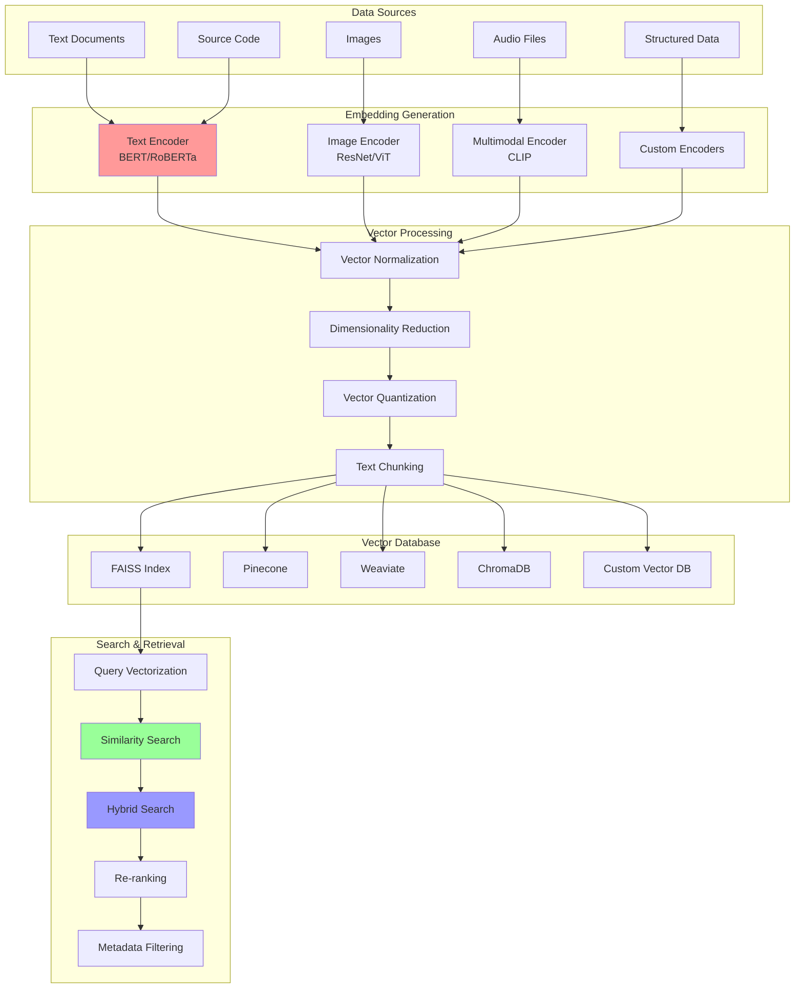

# Vector Search: Semantic Search with Embeddings

Vector search enables semantic similarity search by converting text, images, and other data into high-dimensional vectors. Unlike traditional keyword search, vector search can find semantically similar content even when exact keywords don't match, making it ideal for AI-powered search applications.

## 🧠 Vector Search Architecture



## 🚀 Vector Search Implementation

```python
import asyncio
import numpy as np
import json
import time
import uuid
import pickle
import heapq
from typing import Dict, List, Any, Optional, Tuple, Union
from dataclasses import dataclass, field
from abc import ABC, abstractmethod
from collections import defaultdict
import sqlite3
from concurrent.futures import ThreadPoolExecutor
import threading
import faiss
import requests
from sklearn.feature_extraction.text import TfidfVectorizer
from sklearn.metrics.pairwise import cosine_similarity
from sentence_transformers import SentenceTransformer
import torch

@dataclass
class VectorDocument:
    """Document with vector representation"""
    doc_id: str
    content: str
    metadata: Dict[str, Any]
    vector: Optional[np.ndarray] = None
    timestamp: float = field(default_factory=time.time)
    
    def to_dict(self) -> Dict[str, Any]:
        return {
            'doc_id': self.doc_id,
            'content': self.content,
            'metadata': self.metadata,
            'timestamp': self.timestamp,
            'vector': self.vector.tolist() if self.vector is not None else None
        }
    
    @classmethod
    def from_dict(cls, data: Dict[str, Any]) -> 'VectorDocument':
        doc = cls(
            doc_id=data['doc_id'],
            content=data['content'],
            metadata=data['metadata'],
            timestamp=data['timestamp']
        )
        if data.get('vector'):
            doc.vector = np.array(data['vector'])
        return doc

@dataclass
class VectorSearchQuery:
    """Vector search query"""
    query_text: str
    vector: Optional[np.ndarray] = None
    filters: Dict[str, Any] = field(default_factory=dict)
    k: int = 10  # Number of results
    similarity_threshold: float = 0.0
    hybrid_alpha: float = 0.7  # Weight for vector vs keyword search

@dataclass
class VectorSearchResult:
    """Vector search result"""
    doc_id: str
    content: str
    score: float
    similarity: float
    metadata: Dict[str, Any]
    explanation: Optional[str] = None

class TextEmbedder(ABC):
    """Abstract base class for text embedding models"""
    
    @abstractmethod
    async def encode(self, texts: Union[str, List[str]]) -> np.ndarray:
        """Encode text(s) into vectors"""
        pass
    
    @property
    @abstractmethod
    def dimension(self) -> int:
        """Get embedding dimension"""
        pass

class SentenceTransformerEmbedder(TextEmbedder):
    """Sentence transformer-based embedder"""
    
    def __init__(self, model_name: str = "all-MiniLM-L6-v2"):
        self.model_name = model_name
        try:
            self.model = SentenceTransformer(model_name)
            self._dimension = self.model.get_sentence_embedding_dimension()
        except Exception:
            # Fallback if sentence-transformers not available
            self.model = None
            self._dimension = 384
    
    async def encode(self, texts: Union[str, List[str]]) -> np.ndarray:
        """Encode texts using sentence transformer"""
        if self.model is None:
            # Fallback to simple TF-IDF if model not available
            return await self._fallback_encode(texts)
        
        if isinstance(texts, str):
            texts = [texts]
        
        # Run encoding in thread pool to avoid blocking
        loop = asyncio.get_event_loop()
        embeddings = await loop.run_in_executor(
            None, 
            lambda: self.model.encode(texts)
        )
        
        return embeddings
    
    async def _fallback_encode(self, texts: Union[str, List[str]]) -> np.ndarray:
        """Fallback TF-IDF encoding"""
        if isinstance(texts, str):
            texts = [texts]
        
        # Simple TF-IDF vectorization as fallback
        vectorizer = TfidfVectorizer(max_features=self._dimension, stop_words='english')
        
        try:
            vectors = vectorizer.fit_transform(texts).toarray()
        except ValueError:
            # Handle case where texts are too short
            vectors = np.random.normal(0, 0.1, (len(texts), self._dimension))
        
        return vectors
    
    @property
    def dimension(self) -> int:
        return self._dimension

class OpenAIEmbedder(TextEmbedder):
    """OpenAI embeddings (mock implementation)"""
    
    def __init__(self, api_key: str, model: str = "text-embedding-ada-002"):
        self.api_key = api_key
        self.model = model
        self._dimension = 1536 if "ada-002" in model else 768
    
    async def encode(self, texts: Union[str, List[str]]) -> np.ndarray:
        """Encode using OpenAI API (mock implementation)"""
        if isinstance(texts, str):
            texts = [texts]
        
        # Mock implementation - in reality would call OpenAI API
        # For demo purposes, generate random embeddings
        embeddings = []
        for text in texts:
            # Generate deterministic "embeddings" based on text hash
            text_hash = hash(text) % (2**32)
            np.random.seed(text_hash)
            embedding = np.random.normal(0, 1, self._dimension)
            embedding = embedding / np.linalg.norm(embedding)  # Normalize
            embeddings.append(embedding)
        
        return np.array(embeddings)
    
    @property
    def dimension(self) -> int:
        return self._dimension

class VectorIndex(ABC):
    """Abstract vector index interface"""
    
    @abstractmethod
    async def add_vectors(self, vectors: np.ndarray, ids: List[str]):
        """Add vectors to index"""
        pass
    
    @abstractmethod
    async def search(self, query_vector: np.ndarray, k: int) -> Tuple[List[str], List[float]]:
        """Search for similar vectors"""
        pass
    
    @abstractmethod
    async def remove_vectors(self, ids: List[str]):
        """Remove vectors from index"""
        pass

class FAISSIndex(VectorIndex):
    """FAISS-based vector index"""
    
    def __init__(self, dimension: int, index_type: str = "flat"):
        self.dimension = dimension
        self.index_type = index_type
        
        # Create FAISS index
        if index_type == "flat":
            self.index = faiss.IndexFlatIP(dimension)  # Inner product (cosine similarity)
        elif index_type == "ivf":
            quantizer = faiss.IndexFlatIP(dimension)
            self.index = faiss.IndexIVFFlat(quantizer, dimension, 100)
        elif index_type == "hnsw":
            self.index = faiss.IndexHNSWFlat(dimension, 32)
            self.index.hnsw.efConstruction = 200
            self.index.hnsw.efSearch = 50
        else:
            self.index = faiss.IndexFlatIP(dimension)
        
        # Map index positions to document IDs
        self.id_map: List[str] = []
        self.id_to_index: Dict[str, int] = {}
        self._trained = False
    
    async def add_vectors(self, vectors: np.ndarray, ids: List[str]):
        """Add vectors to FAISS index"""
        # Normalize vectors for cosine similarity
        vectors = vectors / np.linalg.norm(vectors, axis=1, keepdims=True)
        
        # Train index if needed
        if not self._trained and hasattr(self.index, 'train'):
            self.index.train(vectors.astype(np.float32))
            self._trained = True
        
        # Add vectors
        start_idx = len(self.id_map)
        self.index.add(vectors.astype(np.float32))
        
        # Update ID mapping
        for i, doc_id in enumerate(ids):
            self.id_map.append(doc_id)
            self.id_to_index[doc_id] = start_idx + i
    
    async def search(self, query_vector: np.ndarray, k: int) -> Tuple[List[str], List[float]]:
        """Search FAISS index"""
        # Normalize query vector
        query_vector = query_vector / np.linalg.norm(query_vector)
        query_vector = query_vector.reshape(1, -1).astype(np.float32)
        
        # Search
        scores, indices = self.index.search(query_vector, k)
        
        # Convert indices to document IDs
        result_ids = []
        result_scores = []
        
        for i, idx in enumerate(indices[0]):
            if idx >= 0 and idx < len(self.id_map):
                result_ids.append(self.id_map[idx])
                result_scores.append(float(scores[0][i]))
        
        return result_ids, result_scores
    
    async def remove_vectors(self, ids: List[str]):
        """Remove vectors (FAISS doesn't support direct removal)"""
        # FAISS doesn't support efficient removal
        # In practice, would rebuild index or use a deletion mask
        for doc_id in ids:
            if doc_id in self.id_to_index:
                idx = self.id_to_index[doc_id]
                # Mark as deleted (would need custom logic)
                pass

class InMemoryVectorIndex(VectorIndex):
    """Simple in-memory vector index"""
    
    def __init__(self, dimension: int):
        self.dimension = dimension
        self.vectors: Dict[str, np.ndarray] = {}
        self._lock = threading.RLock()
    
    async def add_vectors(self, vectors: np.ndarray, ids: List[str]):
        """Add vectors to memory"""
        with self._lock:
            for i, doc_id in enumerate(ids):
                vector = vectors[i] / np.linalg.norm(vectors[i])  # Normalize
                self.vectors[doc_id] = vector
    
    async def search(self, query_vector: np.ndarray, k: int) -> Tuple[List[str], List[float]]:
        """Search using cosine similarity"""
        with self._lock:
            if not self.vectors:
                return [], []
            
            # Normalize query vector
            query_vector = query_vector / np.linalg.norm(query_vector)
            
            # Calculate similarities
            similarities = []
            for doc_id, vector in self.vectors.items():
                similarity = np.dot(query_vector, vector)
                similarities.append((doc_id, similarity))
            
            # Sort by similarity and return top k
            similarities.sort(key=lambda x: x[1], reverse=True)
            similarities = similarities[:k]
            
            ids = [item[0] for item in similarities]
            scores = [item[1] for item in similarities]
            
            return ids, scores
    
    async def remove_vectors(self, ids: List[str]):
        """Remove vectors from memory"""
        with self._lock:
            for doc_id in ids:
                self.vectors.pop(doc_id, None)

class TextChunker:
    """Splits text into chunks for vector embedding"""
    
    def __init__(self, chunk_size: int = 512, overlap: int = 50):
        self.chunk_size = chunk_size
        self.overlap = overlap
    
    def chunk_text(self, text: str, doc_id: str) -> List[VectorDocument]:
        """Split text into overlapping chunks"""
        words = text.split()
        chunks = []
        
        for i in range(0, len(words), self.chunk_size - self.overlap):
            chunk_words = words[i:i + self.chunk_size]
            chunk_text = ' '.join(chunk_words)
            
            chunk_id = f"{doc_id}_chunk_{i // (self.chunk_size - self.overlap)}"
            
            chunk_doc = VectorDocument(
                doc_id=chunk_id,
                content=chunk_text,
                metadata={
                    'parent_doc_id': doc_id,
                    'chunk_index': i // (self.chunk_size - self.overlap),
                    'chunk_start': i,
                    'chunk_end': min(i + self.chunk_size, len(words))
                }
            )
            
            chunks.append(chunk_doc)
            
            if i + self.chunk_size >= len(words):
                break
        
        return chunks

class VectorSearchEngine:
    """Main vector search engine"""
    
    def __init__(self, embedder: TextEmbedder, index_type: str = "faiss"):
        self.embedder = embedder
        self.dimension = embedder.dimension
        
        # Initialize vector index
        if index_type == "faiss":
            self.vector_index = FAISSIndex(self.dimension)
        else:
            self.vector_index = InMemoryVectorIndex(self.dimension)
        
        # Document storage
        self.documents: Dict[str, VectorDocument] = {}
        
        # Text chunker
        self.chunker = TextChunker()
        
        # Cache
        self.query_cache: Dict[str, List[VectorSearchResult]] = {}
        self.max_cache_size = 1000
        
        # Statistics
        self.stats = {
            'total_documents': 0,
            'total_chunks': 0,
            'total_queries': 0,
            'cache_hits': 0
        }
    
    async def add_document(self, document: VectorDocument):
        """Add document to vector search index"""
        # Chunk the document
        chunks = self.chunker.chunk_text(document.content, document.doc_id)
        
        # Generate embeddings for chunks
        chunk_texts = [chunk.content for chunk in chunks]
        if chunk_texts:
            embeddings = await self.embedder.encode(chunk_texts)
            
            # Add embeddings to chunks
            for i, chunk in enumerate(chunks):
                chunk.vector = embeddings[i]
                self.documents[chunk.doc_id] = chunk
            
            # Add to vector index
            chunk_ids = [chunk.doc_id for chunk in chunks]
            await self.vector_index.add_vectors(embeddings, chunk_ids)
            
            # Update statistics
            self.stats['total_documents'] += 1
            self.stats['total_chunks'] += len(chunks)
            
            # Clear cache when index changes
            self.query_cache.clear()
    
    async def add_documents(self, documents: List[VectorDocument]):
        """Add multiple documents"""
        for document in documents:
            await self.add_document(document)
    
    async def search(self, query: VectorSearchQuery) -> List[VectorSearchResult]:
        """Perform vector search"""
        # Check cache
        cache_key = f"{query.query_text}_{query.k}_{query.similarity_threshold}"
        if cache_key in self.query_cache:
            self.stats['cache_hits'] += 1
            return self.query_cache[cache_key]
        
        self.stats['total_queries'] += 1
        
        # Generate query embedding
        if query.vector is None:
            query_embeddings = await self.embedder.encode(query.query_text)
            query_vector = query_embeddings[0] if len(query_embeddings.shape) > 1 else query_embeddings
        else:
            query_vector = query.vector
        
        # Search vector index
        doc_ids, similarities = await self.vector_index.search(query_vector, query.k * 2)  # Get more for filtering
        
        # Filter and format results
        results = []
        for doc_id, similarity in zip(doc_ids, similarities):
            if similarity < query.similarity_threshold:
                continue
            
            if doc_id not in self.documents:
                continue
            
            document = self.documents[doc_id]
            
            # Apply metadata filters
            if query.filters and not self._matches_filters(document, query.filters):
                continue
            
            result = VectorSearchResult(
                doc_id=doc_id,
                content=document.content,
                score=similarity,
                similarity=similarity,
                metadata=document.metadata,
                explanation=f"Cosine similarity: {similarity:.3f}"
            )
            
            results.append(result)
        
        # Sort by similarity and limit
        results.sort(key=lambda x: x.similarity, reverse=True)
        results = results[:query.k]
        
        # Cache results
        if len(self.query_cache) < self.max_cache_size:
            self.query_cache[cache_key] = results
        
        return results
    
    async def hybrid_search(self, query: VectorSearchQuery, 
                           keyword_results: List[Dict[str, Any]]) -> List[VectorSearchResult]:
        """Combine vector search with keyword search"""
        # Get vector search results
        vector_results = await self.search(query)
        
        # Create combined scoring
        combined_results = {}
        
        # Add vector results
        for result in vector_results:
            combined_results[result.doc_id] = {
                'content': result.content,
                'vector_score': result.similarity,
                'keyword_score': 0.0,
                'metadata': result.metadata
            }
        
        # Add keyword results
        for kw_result in keyword_results:
            doc_id = kw_result['doc_id']
            keyword_score = kw_result.get('score', 0.0)
            
            if doc_id in combined_results:
                combined_results[doc_id]['keyword_score'] = keyword_score
            else:
                combined_results[doc_id] = {
                    'content': kw_result.get('content', ''),
                    'vector_score': 0.0,
                    'keyword_score': keyword_score,
                    'metadata': kw_result.get('metadata', {})
                }
        
        # Calculate hybrid scores
        hybrid_results = []
        for doc_id, scores in combined_results.items():
            hybrid_score = (
                query.hybrid_alpha * scores['vector_score'] + 
                (1 - query.hybrid_alpha) * scores['keyword_score']
            )
            
            result = VectorSearchResult(
                doc_id=doc_id,
                content=scores['content'],
                score=hybrid_score,
                similarity=scores['vector_score'],
                metadata=scores['metadata'],
                explanation=f"Hybrid: {hybrid_score:.3f} (vector: {scores['vector_score']:.3f}, keyword: {scores['keyword_score']:.3f})"
            )
            
            hybrid_results.append(result)
        
        # Sort by hybrid score
        hybrid_results.sort(key=lambda x: x.score, reverse=True)
        return hybrid_results[:query.k]
    
    async def find_similar_documents(self, doc_id: str, k: int = 5) -> List[VectorSearchResult]:
        """Find documents similar to a given document"""
        if doc_id not in self.documents:
            return []
        
        document = self.documents[doc_id]
        if document.vector is None:
            return []
        
        query = VectorSearchQuery(
            query_text="",
            vector=document.vector,
            k=k + 1  # +1 to exclude the document itself
        )
        
        results = await self.search(query)
        
        # Remove the original document from results
        return [r for r in results if r.doc_id != doc_id][:k]
    
    def _matches_filters(self, document: VectorDocument, filters: Dict[str, Any]) -> bool:
        """Check if document matches filters"""
        for key, value in filters.items():
            if key not in document.metadata:
                return False
            
            doc_value = document.metadata[key]
            
            if isinstance(value, list):
                if doc_value not in value:
                    return False
            else:
                if doc_value != value:
                    return False
        
        return True
    
    async def get_document_embedding(self, text: str) -> np.ndarray:
        """Get embedding for text"""
        embeddings = await self.embedder.encode(text)
        return embeddings[0] if len(embeddings.shape) > 1 else embeddings
    
    def get_statistics(self) -> Dict[str, Any]:
        """Get search engine statistics"""
        cache_hit_rate = (
            self.stats['cache_hits'] / max(self.stats['total_queries'], 1)
        ) * 100
        
        return {
            **self.stats,
            'cache_size': len(self.query_cache),
            'cache_hit_rate': cache_hit_rate,
            'embedding_dimension': self.dimension
        }

# Specialized Vector Search Applications
class SemanticCodeSearch:
    """Semantic search for source code"""
    
    def __init__(self, embedder: TextEmbedder):
        self.search_engine = VectorSearchEngine(embedder)
        self.code_processors = {
            'python': self._process_python_code,
            'javascript': self._process_javascript_code,
            'java': self._process_java_code
        }
    
    async def index_code_repository(self, repo_path: str):
        """Index code files from repository"""
        import os
        
        code_extensions = {'.py', '.js', '.java', '.cpp', '.c', '.h'}
        
        for root, dirs, files in os.walk(repo_path):
            for file in files:
                if any(file.endswith(ext) for ext in code_extensions):
                    file_path = os.path.join(root, file)
                    
                    try:
                        with open(file_path, 'r', encoding='utf-8') as f:
                            content = f.read()
                        
                        # Process code content
                        processed_content = await self._process_code_file(file_path, content)
                        
                        document = VectorDocument(
                            doc_id=file_path,
                            content=processed_content,
                            metadata={
                                'file_type': os.path.splitext(file)[1],
                                'file_name': file,
                                'file_path': file_path,
                                'size': len(content)
                            }
                        )
                        
                        await self.search_engine.add_document(document)
                        
                    except Exception as e:
                        print(f"Error processing {file_path}: {e}")
    
    async def _process_code_file(self, file_path: str, content: str) -> str:
        """Process code file for better search"""
        # Extract comments and docstrings
        # Add function/class names
        # Remove noise like imports
        
        extension = os.path.splitext(file_path)[1]
        language = {
            '.py': 'python',
            '.js': 'javascript', 
            '.java': 'java'
        }.get(extension, 'generic')
        
        processor = self.code_processors.get(language, self._process_generic_code)
        return processor(content)
    
    def _process_python_code(self, content: str) -> str:
        """Process Python code"""
        # Extract docstrings, function names, class names
        lines = content.split('\n')
        processed_lines = []
        
        for line in lines:
            stripped = line.strip()
            
            # Function definitions
            if stripped.startswith('def '):
                processed_lines.append(f"function {stripped}")
            
            # Class definitions
            elif stripped.startswith('class '):
                processed_lines.append(f"class {stripped}")
            
            # Comments and docstrings
            elif stripped.startswith('#') or '"""' in stripped:
                processed_lines.append(stripped)
            
            # Non-import statements
            elif not stripped.startswith('import ') and not stripped.startswith('from '):
                if stripped:
                    processed_lines.append(stripped)
        
        return '\n'.join(processed_lines)
    
    def _process_javascript_code(self, content: str) -> str:
        """Process JavaScript code"""
        # Similar processing for JavaScript
        return content  # Simplified
    
    def _process_java_code(self, content: str) -> str:
        """Process Java code"""
        # Similar processing for Java
        return content  # Simplified
    
    def _process_generic_code(self, content: str) -> str:
        """Generic code processing"""
        return content
    
    async def search_code(self, query: str, language: Optional[str] = None) -> List[VectorSearchResult]:
        """Search for code"""
        filters = {}
        if language:
            filters['file_type'] = f'.{language}'
        
        search_query = VectorSearchQuery(
            query_text=query,
            filters=filters,
            k=10
        )
        
        return await self.search_engine.search(search_query)

# Demo Usage
async def demo_vector_search():
    """Demonstrate vector search capabilities"""
    
    print("=== Vector Search Demo ===")
    
    # Initialize embedder (using sentence transformers)
    embedder = SentenceTransformerEmbedder("all-MiniLM-L6-v2")
    
    # Initialize search engine
    search_engine = VectorSearchEngine(embedder, index_type="faiss")
    
    print(f"Embedding dimension: {embedder.dimension}")
    
    # Create sample documents
    documents = [
        VectorDocument(
            doc_id="1",
            content="Machine learning is a subset of artificial intelligence that enables computers to learn and make decisions from data without being explicitly programmed.",
            metadata={"category": "AI", "topic": "machine_learning"}
        ),
        VectorDocument(
            doc_id="2", 
            content="Deep learning uses neural networks with multiple layers to process complex patterns in data, enabling breakthrough results in image recognition and natural language processing.",
            metadata={"category": "AI", "topic": "deep_learning"}
        ),
        VectorDocument(
            doc_id="3",
            content="Python is a versatile programming language popular for data science, web development, and automation tasks due to its simplicity and extensive libraries.",
            metadata={"category": "Programming", "topic": "python"}
        ),
        VectorDocument(
            doc_id="4",
            content="Natural language processing combines computational linguistics with machine learning to help computers understand, interpret and generate human language.",
            metadata={"category": "AI", "topic": "nlp"}
        ),
        VectorDocument(
            doc_id="5",
            content="Data visualization transforms complex datasets into charts, graphs and interactive displays that make patterns and insights more accessible to humans.",
            metadata={"category": "Data Science", "topic": "visualization"}
        )
    ]
    
    # Index documents
    print("\nIndexing documents...")
    await search_engine.add_documents(documents)
    
    print("\n1. Semantic Search:")
    
    # Search for similar concepts
    queries = [
        "artificial intelligence algorithms",
        "computer vision and image recognition", 
        "programming languages for data analysis",
        "understanding human speech"
    ]
    
    for query_text in queries:
        print(f"\nQuery: '{query_text}'")
        
        query = VectorSearchQuery(
            query_text=query_text,
            k=3,
            similarity_threshold=0.1
        )
        
        results = await search_engine.search(query)
        
        for i, result in enumerate(results, 1):
            print(f"  {i}. Score: {result.similarity:.3f}")
            print(f"     Content: {result.content[:100]}...")
            print(f"     Category: {result.metadata.get('category')}")
    
    print("\n2. Filtered Search:")
    
    # Search within specific category
    ai_query = VectorSearchQuery(
        query_text="learning from data",
        filters={"category": "AI"},
        k=5
    )
    
    ai_results = await search_engine.search(ai_query)
    print(f"\nAI documents matching 'learning from data':")
    
    for result in ai_results:
        print(f"  - {result.metadata.get('topic')}: {result.similarity:.3f}")
    
    print("\n3. Similar Document Discovery:")
    
    # Find documents similar to a specific document
    similar_docs = await search_engine.find_similar_documents("2", k=3)
    print(f"\nDocuments similar to document 2 (deep learning):")
    
    for result in similar_docs:
        print(f"  - Doc {result.doc_id}: {result.similarity:.3f}")
        print(f"    Topic: {result.metadata.get('topic')}")
    
    print("\n4. Direct Vector Similarity:")
    
    # Get embeddings for custom text
    custom_text = "neural networks and artificial intelligence"
    custom_embedding = await search_engine.get_document_embedding(custom_text)
    
    vector_query = VectorSearchQuery(
        query_text="",
        vector=custom_embedding,
        k=3
    )
    
    vector_results = await search_engine.search(vector_query)
    print(f"\nSimilar to '{custom_text}':")
    
    for result in vector_results:
        print(f"  - {result.similarity:.3f}: {result.metadata.get('topic')}")
    
    print("\n5. Code Search Demo:")
    
    # Demo semantic code search
    code_embedder = SentenceTransformerEmbedder("all-MiniLM-L6-v2")
    code_search = SemanticCodeSearch(code_embedder)
    
    # Add sample code documents
    code_docs = [
        VectorDocument(
            doc_id="code_1",
            content="def calculate_fibonacci(n): # Calculate nth Fibonacci number using recursion",
            metadata={"file_type": ".py", "language": "python"}
        ),
        VectorDocument(
            doc_id="code_2", 
            content="function sortArray(arr) { // Sort array using quicksort algorithm",
            metadata={"file_type": ".js", "language": "javascript"}
        )
    ]
    
    await code_search.search_engine.add_documents(code_docs)
    
    code_results = await code_search.search_code("recursive algorithm for sequence calculation")
    print(f"\nCode search for 'recursive algorithm':")
    
    for result in code_results:
        print(f"  - {result.similarity:.3f}: {result.content[:50]}...")
    
    # Statistics
    print("\n6. Search Statistics:")
    stats = search_engine.get_statistics()
    for key, value in stats.items():
        print(f"  {key}: {value}")
    
    print("\n✅ Vector Search Demo Complete!")

if __name__ == "__main__":
    asyncio.run(demo_vector_search())
```

---

**Key Features:**
- **Semantic Understanding**: Find conceptually similar content beyond keyword matching
- **Multiple Embedders**: Support for Sentence Transformers, OpenAI, custom models
- **Vector Indexes**: FAISS and in-memory options for different scale needs
- **Text Chunking**: Handle large documents with overlapping chunks
- **Hybrid Search**: Combine vector and keyword search for best results
- **Code Search**: Specialized semantic search for source code

**Related:** See [Search Systems](search-systems.md) for traditional search methods and [Search Performance](search-performance.md) for optimization strategies.
