# WhatsApp System Design

Design a real-time messaging platform like WhatsApp that supports billions of users with end-to-end encryption and multimedia messaging.

## 📋 Problem Statement

Design WhatsApp that supports:
- Real-time messaging between users
- Group chats with up to 256 members
- Media sharing (images, videos, documents)
- Voice and video calls
- Status updates (Stories)
- End-to-end encryption
- Message delivery confirmations

## 🎯 Requirements

### Functional Requirements
- **1-to-1 Messaging**: Private conversations between users
- **Group Messaging**: Groups with up to 256 members
- **Media Sharing**: Photos, videos, documents, voice messages
- **Real-time Delivery**: Messages delivered instantly
- **Message Status**: Sent, delivered, read indicators
- **Online Presence**: Show user online/offline status
- **Message History**: Store and sync message history
- **Push Notifications**: Notify users of new messages

### Non-Functional Requirements
- **Scale**: 2+ billion users, 100 billion messages daily
- **Latency**: <100ms message delivery
- **Availability**: 99.99% uptime
- **Security**: End-to-end encryption
- **Global**: Worldwide service
- **Storage**: 1 year message retention

## 📊 Capacity Estimation

### User & Message Statistics
```
Total Users: 2B
Daily Active Users: 1.5B
Messages per user per day: 50
Total daily messages: 75B

Message breakdown:
- Text messages: 60B (80%)
- Images: 10B (13%)
- Videos: 3B (4%)
- Documents: 2B (3%)
```

### Storage Requirements
```
Text messages: 60B × 100 bytes = 6TB/day
Images: 10B × 200KB = 2PB/day
Videos: 3B × 2MB = 6PB/day
Documents: 2B × 500KB = 1PB/day

Total daily storage: ~9PB/day
Annual storage: 9PB × 365 = 3.3EB/year

With compression and deduplication: ~1EB/year
```

### Bandwidth Requirements
```
Peak messages: 1M messages/second
Average message size: 2KB
Peak bandwidth: 2GB/second
```

## 🏗️ High-Level Architecture


## 🗄️ Database Design

### User Entity


### Message Entity


### Complete ER Diagram


## 🔄 Core Workflows

### Message Sending Flow


### Group Message Flow

```mermaid
sequenceDiagram
    participant U as User
    participant MS as Message Service
    participant GS as Group Service
    participant Q as Message Queue
    participant M1 as Member 1
    participant M2 as Member 2
    participant MN as Member N
    
    U->>MS: Send Group Message
    MS->>GS: Get Group Members
    GS->>MS: Return Member List
    
    Note over MS: Create message copies
    Note over MS: Encrypt for each member
    
    MS->>Q: Queue Multiple Deliveries
    
    par Parallel Delivery
        Q->>M1: Deliver Message
        Q->>M2: Deliver Message
        Q->>MN: Deliver Message
    end
    
    Note over MS: Track delivery status
    MS->>U: Group Message Sent ✓
```


### Online Presence Flow


## 🔐 End-to-End Encryption

### Signal Protocol Implementation
WhatsApp uses the Signal Protocol for E2E encryption.


### Key Exchange Process


## 📱 Real-time Communication

### WebSocket Connection Management


### Message Delivery Guarantees


## 🚀 Scalability Solutions

### Database Sharding Strategy

#### Message Sharding by Chat ID


#### Time-based Partitioning
```python
def get_message_partition(timestamp):
    # Partition by month
    year_month = timestamp.strftime("%Y-%m")
    return f"messages_{year_month}"

# Examples:
# 2024-01 messages -> messages_2024_01
# 2024-02 messages -> messages_2024_02
```

### Caching Strategy


## 📊 Media Handling

### Media Upload Flow


### Media Storage Optimization


## 🔔 Push Notifications

### Notification Architecture


### Smart Notification Batching
```python
class NotificationBatcher:
    def __init__(self):
        self.batch_window = 30  # seconds
        self.pending_notifications = {}
    
    def add_notification(self, user_id, message):
        if user_id not in self.pending_notifications:
            self.pending_notifications[user_id] = []
            # Schedule batch send
            schedule_task(self.send_batch, user_id, delay=self.batch_window)
        
        self.pending_notifications[user_id].append(message)
    
    def send_batch(self, user_id):
        messages = self.pending_notifications.pop(user_id, [])
        if messages:
            count = len(messages)
            if count == 1:
                text = f"New message from {messages[0].sender}"
            else:
                text = f"{count} new messages"
            
            send_push_notification(user_id, text)
```

## 📈 Performance Optimizations

### Message Compression
```python
import gzip
import json

def compress_message(message_data):
    # Convert to JSON and compress
    json_data = json.dumps(message_data).encode('utf-8')
    compressed = gzip.compress(json_data)
    
    # Only use compression if it reduces size significantly
    if len(compressed) < len(json_data) * 0.8:
        return compressed, True
    return json_data, False

def decompress_message(data, is_compressed):
    if is_compressed:
        return json.loads(gzip.decompress(data).decode('utf-8'))
    return json.loads(data.decode('utf-8'))
```

### Connection Pooling


## 🌍 Global Architecture

### Multi-Region Deployment


## 🎯 API Design

### Core Endpoints
```http
# Authentication
POST /api/v1/auth/verify-phone
POST /api/v1/auth/verify-code

# Messaging
POST /api/v1/messages
GET /api/v1/messages/{chat_id}
PUT /api/v1/messages/{message_id}/status

# Groups
POST /api/v1/groups
POST /api/v1/groups/{group_id}/members
DELETE /api/v1/groups/{group_id}/members/{user_id}

# Media
POST /api/v1/media/upload
GET /api/v1/media/{media_id}

# Presence
PUT /api/v1/presence/online
PUT /api/v1/presence/offline
```

### WebSocket Events
```json
{
  "type": "message",
  "data": {
    "message_id": "uuid",
    "chat_id": "chat123",
    "sender_id": "user456",
    "content": "encrypted_content",
    "timestamp": "2024-01-15T10:30:00Z",
    "message_type": "text"
  }
}

{
  "type": "typing",
  "data": {
    "chat_id": "chat123",
    "user_id": "user456",
    "is_typing": true
  }
}

{
  "type": "presence",
  "data": {
    "user_id": "user456",
    "status": "online",
    "last_seen": "2024-01-15T10:30:00Z"
  }
}
```

## ⚖️ Trade-offs & Design Decisions

### Trade-offs Made

| Decision | Benefit | Cost |
|----------|---------|------|
| **End-to-End Encryption** | Strong privacy | Cannot search message content |
| **Real-time Delivery** | Great UX | High infrastructure cost |
| **Phone Number as ID** | Easy discovery | Privacy concerns |
| **Media Compression** | Reduced bandwidth | Processing overhead |

### Bottlenecks & Solutions

1. **WebSocket Connections**: Use connection pools and horizontal scaling
2. **Message Delivery**: Implement efficient routing and caching
3. **Media Storage**: Use CDN and tiered storage
4. **Database Writes**: Shard by chat_id and use write-through caching

## 🔧 Technology Stack

- **Backend**: Erlang/OTP (high concurrency)
- **Database**: Cassandra (messages), PostgreSQL (users)
- **Cache**: Redis (presence, recent messages)
- **Message Queue**: Apache Kafka
- **Storage**: Amazon S3, CloudFront CDN
- **Push Notifications**: FCM, APNS
- **Monitoring**: Custom tools, Prometheus

---

**Key Insights**: WhatsApp's architecture prioritizes real-time communication, privacy through encryption, and efficient resource utilization. The use of Erlang enables handling millions of concurrent connections with minimal resources.
