# YouTube System Design

Design a video streaming platform like YouTube that supports billions of users, millions of video uploads, and massive global video consumption.

## 📋 Problem Statement

Design YouTube that supports:
- Video upload and storage
- Video streaming to billions of users
- Video processing (multiple formats/qualities)
- User interactions (likes, comments, subscriptions)
- Search and recommendations
- Global content delivery
- Monetization through ads

## 🎯 Requirements

### Functional Requirements
- **Video Upload**: Users can upload videos up to 12 hours
- **Video Streaming**: Watch videos in multiple qualities
- **Video Processing**: Convert to multiple formats and resolutions
- **User Management**: Channels, subscriptions, playlists
- **Search**: Find videos by title, description, tags
- **Recommendations**: Personalized video suggestions
- **Social Features**: Likes, dislikes, comments, shares
- **Analytics**: View count, engagement metrics

### Non-Functional Requirements
- **Scale**: 2.7 billion users, 720,000 hours uploaded daily
- **Availability**: 99.9% uptime globally
- **Latency**: Video start time <3 seconds
- **Storage**: Petabytes of video content
- **Bandwidth**: Massive global CDN
- **Processing**: Real-time video transcoding

## 📊 Capacity Estimation

### Video Statistics
```
Total Users: 2.7B
Daily Active Users: 2B
Videos uploaded per day: 720K hours = 500 hours/minute
Average video size: 1GB/hour (before compression)
Daily upload volume: 720TB
Average concurrent viewers: 1B
```

### Storage Requirements
```
Video storage per day: 720TB
Multiple format storage (4 qualities): 720TB × 4 = 2.88PB/day
Annual storage: 2.88PB × 365 = 1.05EB/year

With compression and optimization: ~500PB/year
Total storage needed (10 years): 5EB
```

### Bandwidth Requirements
```
Peak concurrent streams: 1B users
Average bitrate per stream: 2 Mbps
Peak bandwidth: 1B × 2 Mbps = 2 Petabits/second

Daily data transfer: 
- Video serving: 100PB/day
- Video uploads: 3PB/day
```

## 🏗️ High-Level Architecture

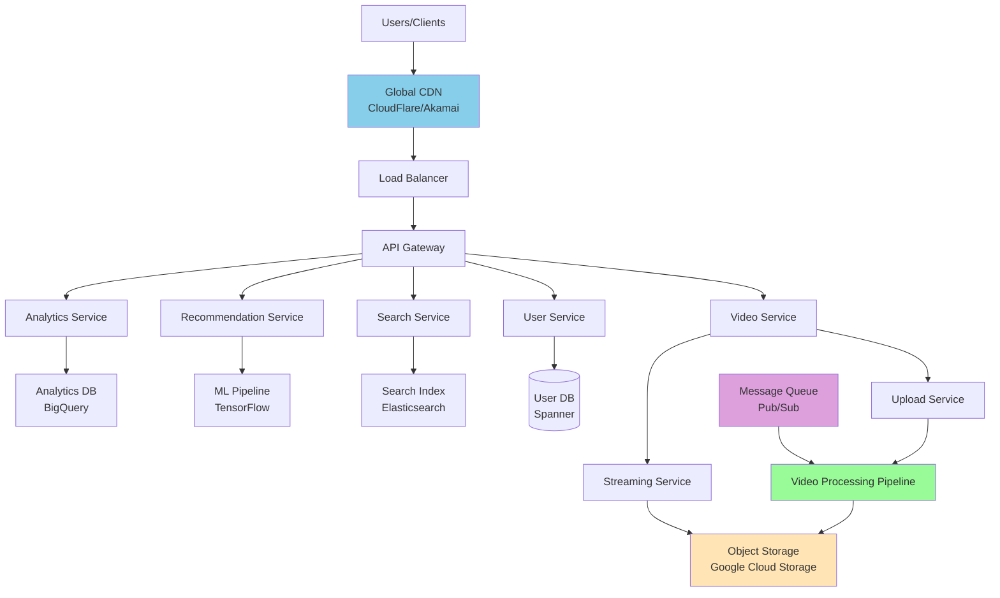

## 🗄️ Database Design

### Video Entity
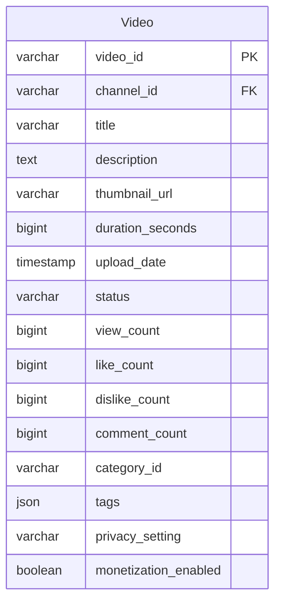

### Complete ER Diagram
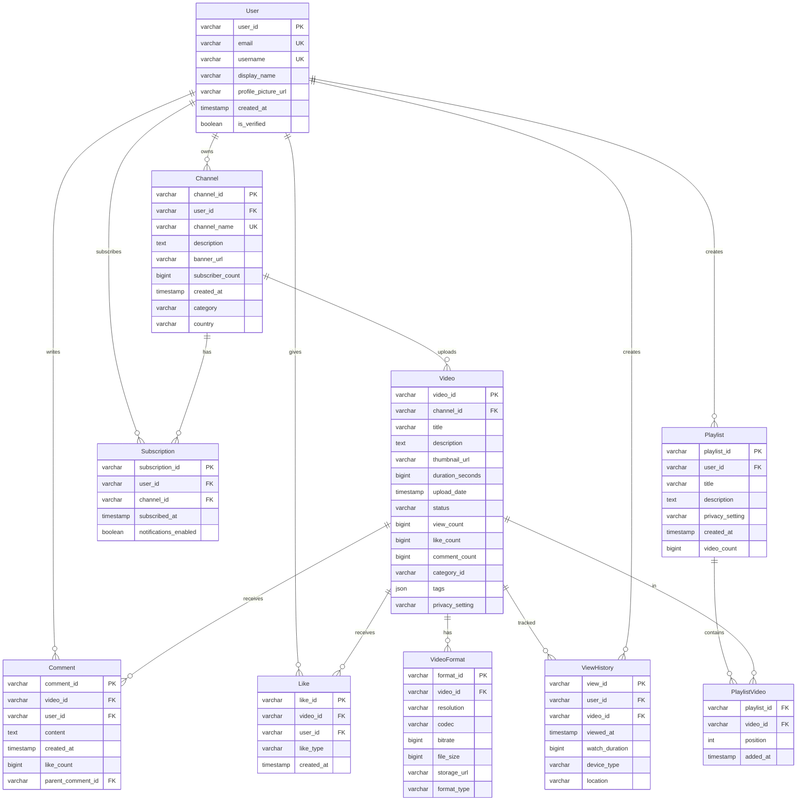

## 🎥 Video Processing Pipeline

### Upload and Processing Flow
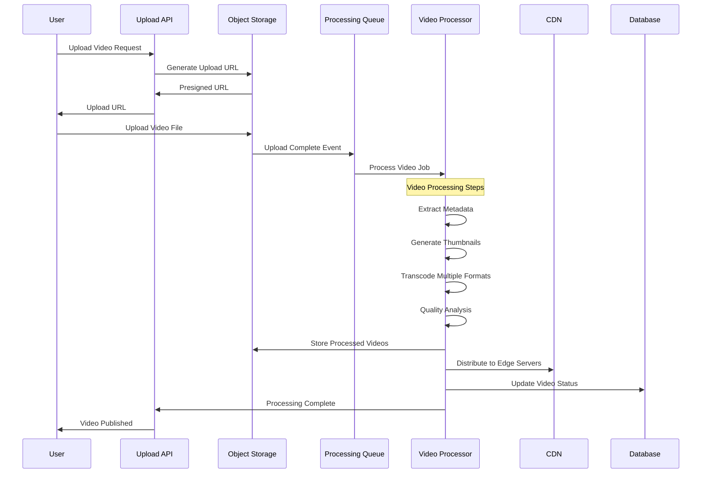

### Video Processing Details
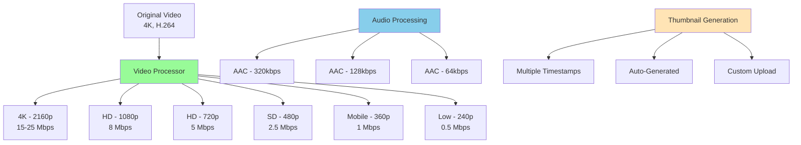

### Adaptive Bitrate Streaming
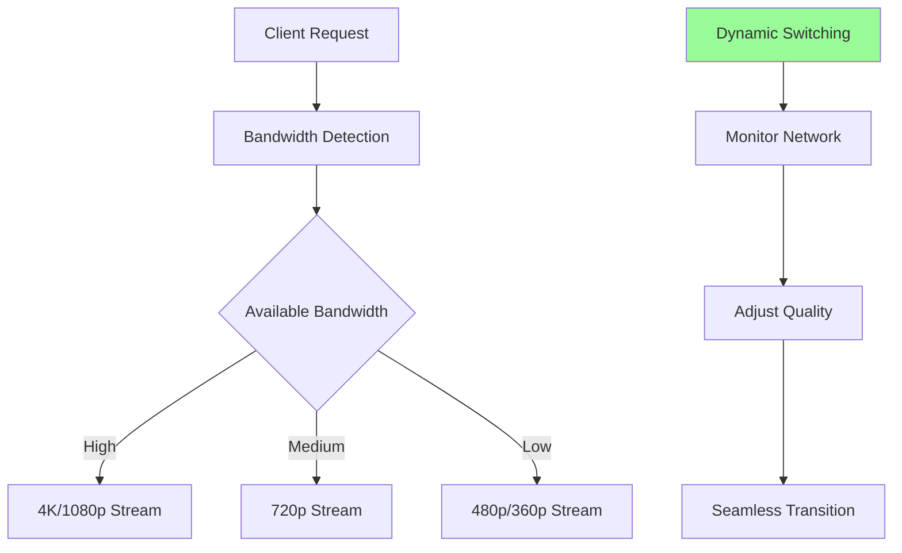

## 🌐 Global Content Delivery

### CDN Architecture
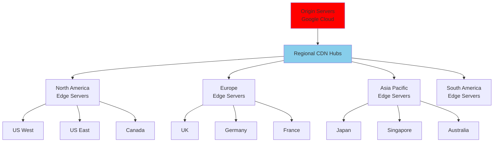

### Intelligent Caching Strategy
```python
class VideoCacheManager:
    def __init__(self):
        self.cache_tiers = {
            'hot': 24 * 3600,      # 1 day - popular content
            'warm': 7 * 24 * 3600,  # 1 week - moderately popular
            'cold': 30 * 24 * 3600  # 1 month - archive
        }
    
    def determine_cache_tier(self, video_metadata):
        views_per_hour = video_metadata['view_count'] / video_metadata['hours_since_upload']
        subscriber_count = video_metadata['channel_subscriber_count']
        
        # Trending video
        if views_per_hour > 1000 or subscriber_count > 1000000:
            return 'hot'
        
        # Popular video
        elif views_per_hour > 100 or subscriber_count > 100000:
            return 'warm'
        
        # Regular video
        else:
            return 'cold'
    
    def cache_video(self, video_id, quality, tier):
        ttl = self.cache_tiers[tier]
        
        # Cache in multiple edge locations based on tier
        if tier == 'hot':
            locations = self.get_all_edge_locations()
        elif tier == 'warm':
            locations = self.get_major_edge_locations()
        else:
            locations = self.get_regional_edge_locations()
        
        for location in locations:
            self.replicate_to_edge(video_id, quality, location, ttl)
```

## 🔍 Search and Discovery

### Search Architecture
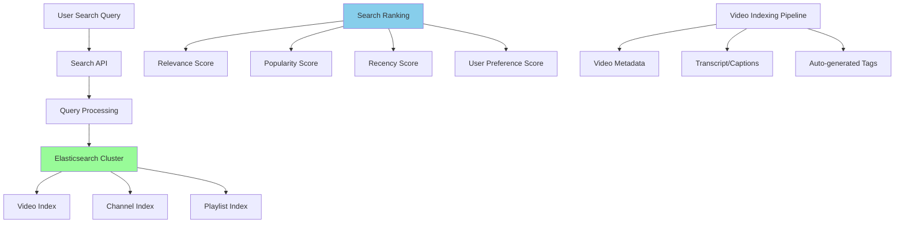

### Search Indexing
```json
{
  "video_id": "dQw4w9WgXcQ",
  "title": "Rick Astley - Never Gonna Give You Up",
  "description": "The official video for Never Gonna Give You Up by Rick Astley",
  "channel": {
    "id": "UCuAXFkgsw1L7xaCfnd5JJOw",
    "name": "Rick Astley",
    "subscriber_count": 2500000
  },
  "tags": ["rick astley", "never gonna give you up", "rickroll", "80s music"],
  "category": "Music",
  "duration": 213,
  "upload_date": "2009-10-25T06:57:33Z",
  "view_count": 1200000000,
  "like_count": 13000000,
  "comment_count": 2100000,
  "transcript": "We're no strangers to love, you know the rules and so do I...",
  "auto_tags": ["music video", "pop", "dance", "vintage"],
  "quality_score": 0.95,
  "engagement_rate": 0.08
}
```

## 🧠 Recommendation System

### Recommendation Architecture
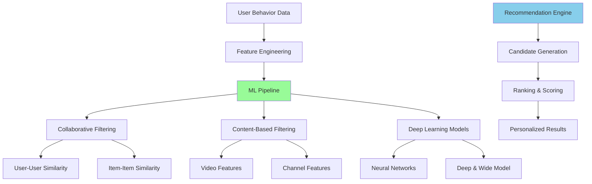

### Recommendation Algorithm
```python
class YouTubeRecommendationEngine:
    def __init__(self):
        self.collaborative_model = CollaborativeFilteringModel()
        self.content_model = ContentBasedModel()
        self.deep_model = DeepNeuralNetwork()
        self.ranking_model = RankingModel()
    
    def generate_recommendations(self, user_id, num_recommendations=20):
        # Candidate generation from multiple sources
        candidates = []
        
        # 1. Collaborative filtering candidates
        cf_candidates = self.collaborative_model.get_candidates(user_id, limit=1000)
        candidates.extend(cf_candidates)
        
        # 2. Content-based candidates
        user_interests = self.get_user_interests(user_id)
        cb_candidates = self.content_model.get_candidates(user_interests, limit=1000)
        candidates.extend(cb_candidates)
        
        # 3. Trending and viral content
        trending_candidates = self.get_trending_videos(limit=200)
        candidates.extend(trending_candidates)
        
        # 4. Channel subscriptions
        subscription_candidates = self.get_subscription_videos(user_id, limit=500)
        candidates.extend(subscription_candidates)
        
        # Remove duplicates and already watched
        candidates = self.deduplicate_and_filter(user_id, candidates)
        
        # Ranking phase
        ranked_videos = self.ranking_model.rank(user_id, candidates)
        
        return ranked_videos[:num_recommendations]
    
    def get_user_interests(self, user_id):
        # Analyze user's watch history, likes, search queries
        watch_history = self.get_watch_history(user_id, limit=1000)
        
        interests = {
            'categories': self.extract_categories(watch_history),
            'keywords': self.extract_keywords(watch_history),
            'channels': self.extract_preferred_channels(watch_history),
            'video_length_preference': self.analyze_duration_preference(watch_history)
        }
        
        return interests
```

## 📊 Analytics and Monitoring

### Real-time Analytics Pipeline
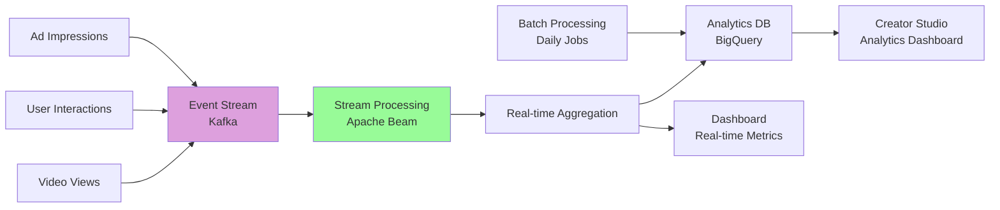

### Key Metrics Tracking
```python
class AnalyticsTracker:
    def __init__(self):
        self.event_publisher = EventPublisher()
        self.metrics_store = MetricsStore()
    
    def track_video_view(self, user_id, video_id, watch_duration, quality):
        event = {
            'event_type': 'video_view',
            'user_id': user_id,
            'video_id': video_id,
            'timestamp': int(time.time()),
            'watch_duration': watch_duration,
            'video_quality': quality,
            'device_type': self.get_device_type(),
            'location': self.get_user_location(user_id)
        }
        
        # Real-time event
        self.event_publisher.publish('video_events', event)
        
        # Update real-time counters
        self.metrics_store.increment(f"video:{video_id}:views")
        self.metrics_store.increment(f"video:{video_id}:watch_time", watch_duration)
    
    def track_engagement(self, user_id, video_id, action_type):
        event = {
            'event_type': 'engagement',
            'user_id': user_id,
            'video_id': video_id,
            'action': action_type,  # like, dislike, comment, share
            'timestamp': int(time.time())
        }
        
        self.event_publisher.publish('engagement_events', event)
        self.metrics_store.increment(f"video:{video_id}:{action_type}")
```

## 💰 Monetization System

### Ad Serving Architecture
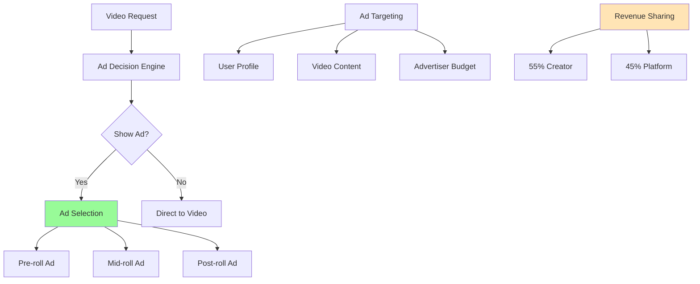

## 🚀 Performance Optimizations

### Video Startup Optimization
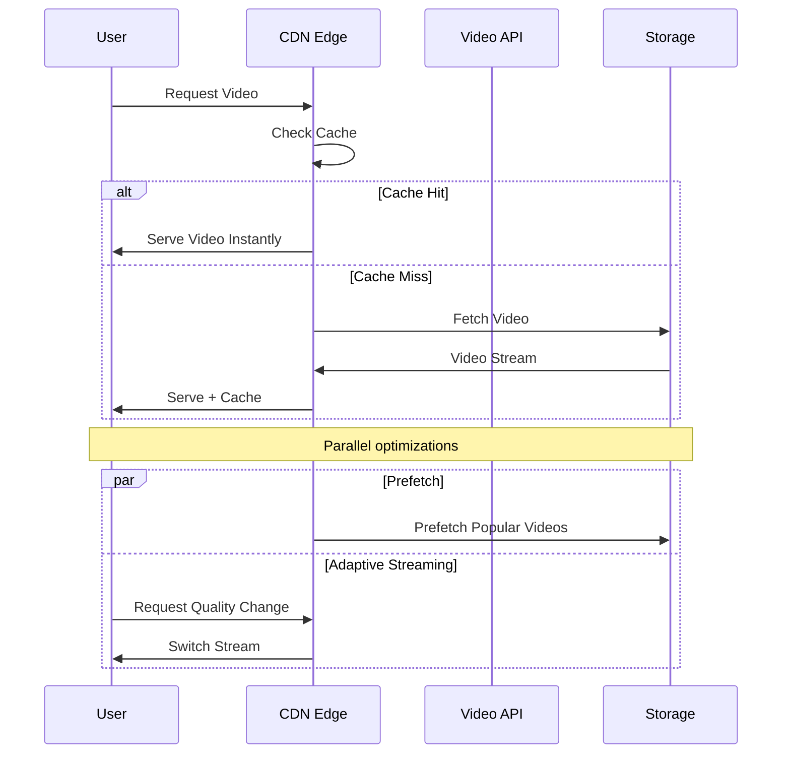

### Thumbnail Optimization
```python
class ThumbnailOptimizer:
    def __init__(self):
        self.ml_model = ThumbnailMLModel()
    
    def generate_optimal_thumbnails(self, video_id, video_file):
        # Extract frames at key moments
        key_frames = self.extract_key_frames(video_file)
        
        # Generate multiple thumbnail candidates
        candidates = []
        for frame in key_frames:
            # Create different crops and compositions
            thumbnails = self.create_thumbnail_variants(frame)
            candidates.extend(thumbnails)
        
        # Score thumbnails using ML model
        scored_thumbnails = []
        for thumbnail in candidates:
            score = self.ml_model.predict_click_through_rate(thumbnail)
            scored_thumbnails.append((thumbnail, score))
        
        # Return top candidates
        sorted_thumbnails = sorted(scored_thumbnails, key=lambda x: x[1], reverse=True)
        return [thumb[0] for thumb in sorted_thumbnails[:5]]
    
    def a_b_test_thumbnails(self, video_id, thumbnails):
        # Serve different thumbnails to different user segments
        # Track click-through rates
        # Select winner after statistical significance
        pass
```

## 🔧 Technology Stack

### Infrastructure
- **Video Storage**: Google Cloud Storage, distributed globally
- **CDN**: YouTube's proprietary CDN with 1000+ edge locations
- **Database**: Google Spanner (globally distributed SQL)
- **Search**: Elasticsearch with custom ranking algorithms
- **ML Platform**: TensorFlow, custom recommendation models
- **Streaming**: Custom video delivery protocol

### Video Technology
- **Encoding**: VP9, AV1 for compression efficiency
- **Adaptive Streaming**: DASH (Dynamic Adaptive Streaming)
- **Live Streaming**: Custom low-latency protocol
- **Processing**: Custom video processing infrastructure

## ⚖️ Trade-offs and Decisions

### Key Trade-offs

| Decision | Benefit | Cost |
|----------|---------|------|
| **Multiple Video Qualities** | Better user experience | 4x storage cost |
| **Global CDN** | Low latency worldwide | High infrastructure cost |
| **Sophisticated Recommendations** | Higher engagement | Complex ML infrastructure |
| **Long Video Storage** | Creator flexibility | Massive storage requirements |

### Bottlenecks and Solutions

1. **Video Processing**: Distributed processing clusters with auto-scaling
2. **Storage Costs**: Intelligent caching and compression
3. **Global Latency**: Edge caching and regional data centers
4. **Search Performance**: Distributed search with relevance caching

## 📈 Scale Achievements

YouTube's impressive scale metrics:
- **500 hours** of video uploaded every minute
- **1 billion hours** watched daily
- **2 billion** logged-in monthly users
- **100+ countries** with localized versions
- **80+ languages** supported

---

**Key Insights**: YouTube's success relies on massive-scale video processing, intelligent global content delivery, sophisticated recommendation algorithms, and seamless user experience across all devices and network conditions.
